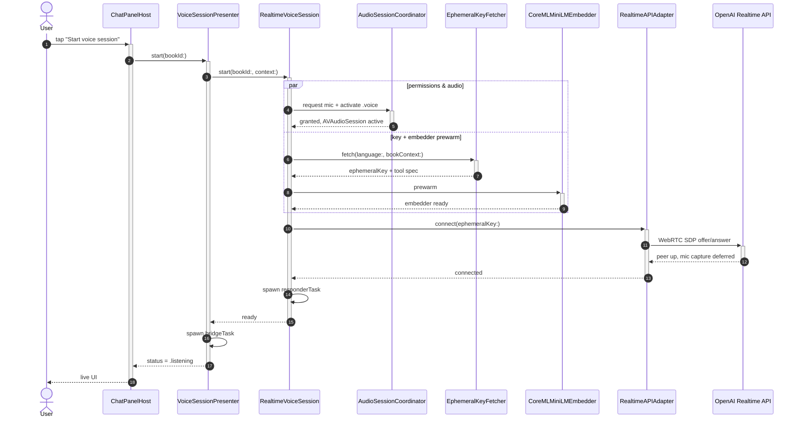
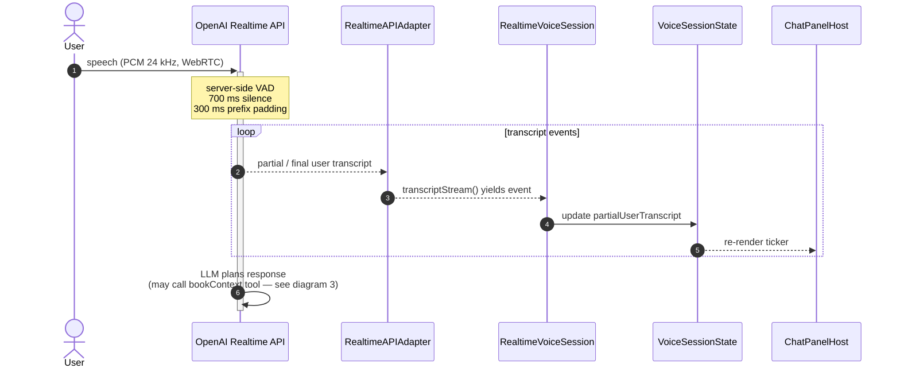
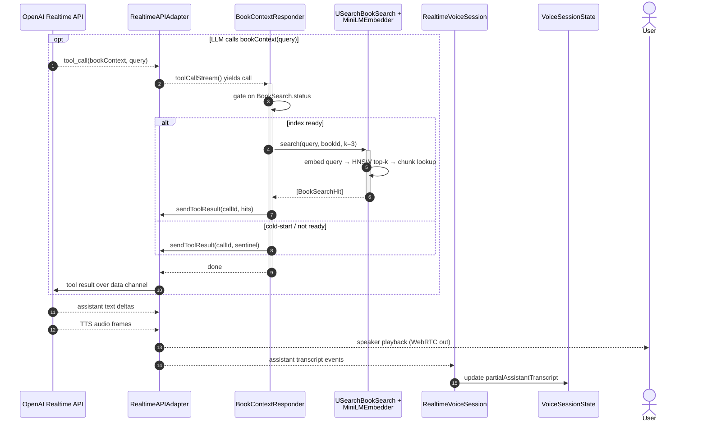
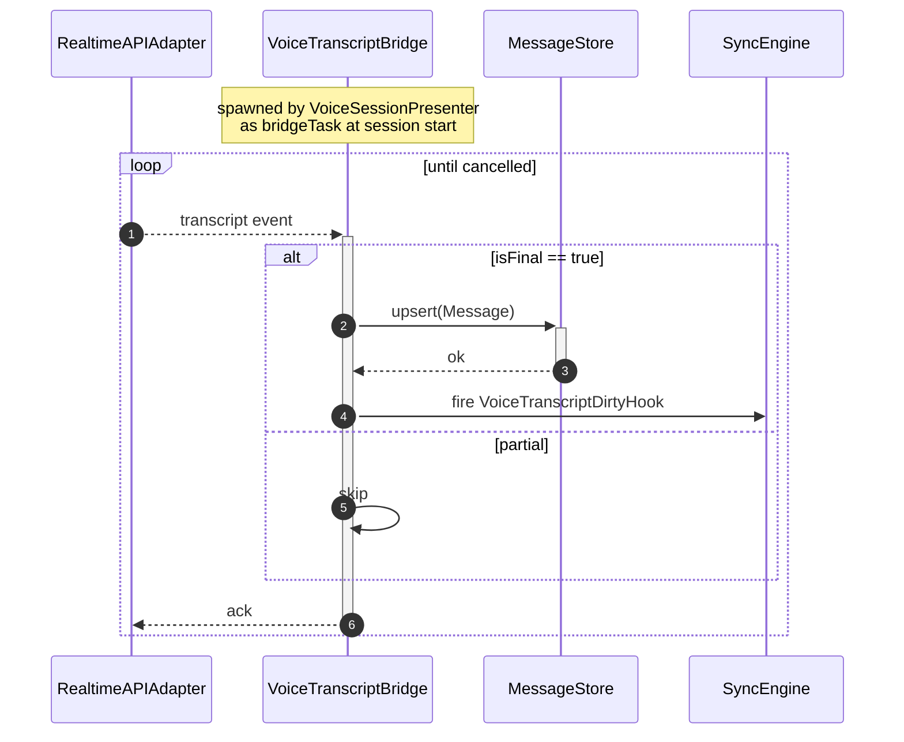
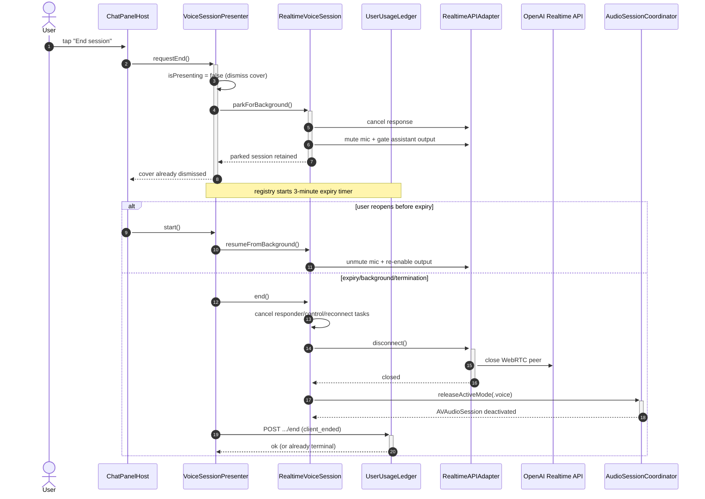

# Voice Chat Pipeline

End-to-end sequence of a voice chat session in the iOS app — from the user tapping the mic button in `ChatPanelHost` through OpenAI's Realtime API, on-device RAG against the open book, and persisted transcripts.

Broken into four diagrams by lifecycle phase:

1. [Session start](#1-session-start) — permissions, key fetch, embedder prewarm, WebRTC connect
2. [Turn — user speech → LLM](#2-turn--user-speech--llm) — server-side VAD + STT, live transcript UI
3. [Turn — RAG tool callback + response](#3-turn--rag-tool-callback--response) — `bookContext` tool call, HNSW search, TTS audio back
4. [Transcript persistence (parallel)](#4-transcript-persistence-parallel) — `VoiceTranscriptBridge` writes finalized messages
5. [Session end](#5-session-end) — ordered teardown so in-flight tool results don't race

## Participants

| Participant | File | Notes |
|---|---|---|
| `ChatPanelHost` | `rishi/rishi/Views/ChatPanelHost.swift` | SwiftUI entry, "Start voice session" button |
| `VoiceSessionPresenter` | `rishi/rishi/Voice/VoiceSessionPresenter.swift` | `@MainActor` presenter, owns `bridgeTask` |
| `RealtimeVoiceSession` | `Packages/RishiVoice/.../RealtimeVoiceSession.swift` | actor, owns `responderTask` + lifecycle |
| `AudioSessionCoordinator` | `Packages/RishiVoice/...` | `AVAudioSession` + `MicPermissionGate` |
| `EphemeralKeyFetcher` | `Packages/RishiVoice/...` | short-lived API key from worker |
| `RealtimeAPIAdapter` | `Packages/RishiVoice/.../RealtimeAPIAdapter.swift` | wraps `swift-realtime-openai` SDK |
| OpenAI Realtime API | server | server-side VAD, STT, LLM, TTS over WebRTC |
| `BookContextResponder` | `Packages/RishiVoice/Service/BookContextResponder.swift` | actor, handles `bookContext` tool |
| `USearchBookSearch` + `CoreMLMiniLMEmbedder` | `Packages/RishiSearch/...` | HNSW + on-device embeddings |
| `VoiceTranscriptBridge` | `Packages/RishiVoice/Service/VoiceTranscriptBridge.swift` | actor, persists finalized transcripts |
| `MessageStore` | database-backed | chat persistence + sync hook |
| `VoiceSessionState` | `Packages/RishiVoice/State/VoiceSessionState.swift` | `@Observable` partial-transcript buffers |

---

## 1. Session start

Permissions, ephemeral key fetch, and embedder prewarm run in parallel to hide the ~500 ms CoreML cold-load behind the network round-trip. Only then does the WebRTC peer connection get established.

**Activation phase (2026-07-23, experimental — blocked):** The intended flow starts `VoiceActivationCoordinator` immediately after claiming `.voice`, records locally during `deferMicCapture: true`, then replays early speech before enabling the VoIP unit. The audited implementation currently loses speech on first-use Speech permission and on the Energy VAD fallback; PCM replay acceptance/fallback is also unverified. Do not rely on this path until the [implementation audit](superpowers/specs/2026-07-23-voice-activation-pcm-handoff-design.md#implementation-audit--2026-07-23) is remediated.

**Never enable the VoIP audio unit while the activation recorder is running.** `AVAudioEngine` + `LKRTCAudioSession` dual capture drops ICE (~1.5 s after `.live` once reconnect observation arms). See [Reconnecting loop](#reconnecting-loop).



---

## 2. Turn — user speech → LLM

Server-side VAD on the OpenAI side decides when the user has stopped talking (700 ms silence, 300 ms prefix padding). Partial and final transcript events flow back through the SDK and update the `@Observable` state that drives the live ticker.



---

## 3. Turn — RAG tool callback + response

The LLM decides *when* to fetch book context. When it does, the SDK surfaces a `tool_call` that the `BookContextResponder` handles on-device against the open book's HNSW index. The LLM then resumes generation and the response is streamed back as both text (for the ticker) and TTS audio (played by the SDK directly).



---

## 4. Transcript persistence (parallel)

`VoiceTranscriptBridge` runs as a parallel consumer of the same transcript stream. It only writes on `isFinal=true`, so partial-transcript churn never hits disk. The `VoiceTranscriptDirtyHook` lets `SyncEngine` pick up new messages without polling.



---

## 5. Session end

Teardown order is load-bearing: `responderTask` is cancelled *before* `client.disconnect()` so it can't attempt `sendToolResult` on a closed data channel. The audio session is released last.

**End parks the session for quick resume:** the cover dismisses immediately, the current response is cancelled, microphone capture is muted, assistant output is gated, and reconnect observation is stopped. The `VoiceSessionRegistry` retains the session object and starts a three-minute expiry timer. Reopening voice before expiry unmutes the existing connection; expiry performs the full local teardown and then delivers `POST …/end`.

**Background/termination closes immediately:** `scenePhase == .background` and the best-effort termination callback route through `VoiceSessionPresenter.requestEnd()`, which closes the transport and releases the audio mode without the three-minute grace period. The registry persists the Rishi session ID until server end is confirmed. Startup recovery retries that ID so a crash/force-quit cannot leave a server ledger row active indefinitely.



---

## Inactivity timeout (5 minutes)

Server-authoritative idle end on `UserUsageLedger`. Realtime sessions terminate with reason `inactivity_timeout` when `lastActivityAt` is missing or older than **5 minutes** (`INACTIVITY_TIMEOUT_MS`). Detection lag is up to one Voice Chat interval (~30s) after the 5-minute mark — the existing alarm runs the check; there is no second idle alarm.

### What counts as activity

| Signal | Refreshes `lastActivityAt`? |
| --- | --- |
| Control WS `{type:"client_activity"}` on user **or** assistant transcript progress (partial or final) | **yes** (WS-tagged session only) |
| 30s interval charge / allowance tick | **no** |
| Control WS connect, snapshot, allowance broadcast | **no** |
| Advisory `{type:"client_ack"}` / `disconnect()` teardown | **no** |

`VoiceTranscriptBridge` is the sole `transcriptStream()` consumer and fires `onActivity` → `RealtimeVoiceSession.notifyVoiceActivity()` → `sendClientActivity()` on every event.

### OpenAI hangup

`terminateSession(..., "inactivity_timeout")` uses the same hangup path as other terminal reasons: when `callId` is set, the ledger attempts OpenAI hangup.

### Create after timeout

A timed-out session is terminal. The next `POST /api/voice-sessions` gets a **new** session UUID. Null-`callId` orphans (abandoned pending registration) are force-ended on create; realtime with a pending hangup may need one reconcile on create (existing behavior).

### Intentional End vs idle

| Path | Behavior |
| --- | --- |
| User taps End | Cover dismisses, cancels response, mutes both directions, and parks the session for three minutes. Resume reuses it; expiry fully closes it and ends the ledger row. |
| App backgrounds/terminates | Immediate full close; no grace timer. The registry persists the server ID until end confirmation. |
| Crash/force quit | No cleanup code can run at crash time; the next bootstrap retries the persisted server end. |
| Idle ≥ 5 min | Server terminates; client receives `session_ended` / terminal snapshot with `inactivity_timeout` and shows “Voice chat ended due to inactivity.” |

---

## Reconnecting loop

The UI shows **Reconnecting** when `ReconnectController` sees a sustained `.disconnected` status from the Realtime SDK and runs the 1s/2s/4s backoff ladder (max 3 attempts). Log signature:

```
event: voice.session.live
event: voice.control.connecting
event: voice.session.disconnect.transient
ICE Connection State changed to: 6
event: voice.adapter.connecting   (repeated)
event: voice.session.failed reason=networkLost
```

### Known triggers (and how we avoid them)

| Trigger | Symptom in logs | Avoidance |
| --- | --- | --- |
| **Dual capture during connect** | `disconnect.transient` ~1.5 s after `session.live`, ICE → 6, **no** `server_error` | With `deferMicCapture`, **skip** `enableAudioUnit()` in `connect()`. First init only in `setMicCaptureEnabled(true)` after activation recorder stops + 250 ms route settle. |
| **WebRTC re-configures AVAudioSession** | Same ICE pattern during/after connect | `WebRTCConnector.configureAudioSession()` no-ops when category/mode already `.playAndRecord`/`.videoChat` (coordinator owns session). |
| **False-positive disconnect poll** | Transient blip right after `.live` | `ReconnectController` waits **1.5 s** (`observationGracePeriod`) before arming the 10 Hz status poll. |
| **Invalid session.update wire format** | `voice.adapter.server_error`, e.g. `Unknown parameter: session.tools[0].server_description` | Function tools encode `description`, not `server_description` (`Tool.swift`). |
| **Activation PCM replay** | Rejected or unacknowledged data-channel event | Transport acceptance and 0A → 0B → text fallback are unverified; do not rely on PCM replay until the activation audit is remediated. |
| **Reconnecting before data channel open** | Echo / double voice, endless reconnect | `connect()` waits until SDK status is `.connected` before returning (channel must be open). |
| **Redundant VoIP re-init on reconnect ladder** | Repeated `voice.adapter.connecting`, ladder exhausts | `WebRTCAudioUnitController.enableAudioUnit()` is idempotent when `isAudioEnabled` is already true. |

### Debugging

- Symbolic breakpoint: `UIViewAlertForUnsatisfiableConstraints` — unrelated to voice reconnect (Apple Sign In / nav bar layout noise).
- Voice reconnect: breakpoint on log `voice.session.disconnect.transient` or `ReconnectController.handleTransientDisconnect`.
- If ICE 6 appears **without** a preceding server error, suspect audio unit / route churn, not API rejection.

---

## Design notes

- **No on-device STT or TTS for live turns.** Both happen server-side in the OpenAI Realtime API. The SDK owns normal live mic capture and speaker playback. The experimental pre-connect activation recorder is the exception: it produces local PCM, but its handoff is currently blocked by the activation audit.
- **RAG is a tool callback, not a pre-prompt step.** The LLM decides when to call `bookContext(query)`; on-device search only runs on demand. This keeps cold-start cheap and lets the model issue multiple queries per turn.
- **Embedder prewarm is parallelized** with the ephemeral key fetch to hide the ~500 ms CoreML cold-load behind the network round-trip.
- **Single consumer of `transcriptStream()`:** `VoiceTranscriptBridge` persists finals, updates live UI state, and pings `{type:"client_activity"}` for inactivity. Do not attach a second reader.
- **Teardown ordering is load-bearing.** Cancelling `responderTask` before `client.disconnect()` prevents the responder from attempting `sendToolResult` on a closed data channel. Interval ticks and teardown `client_ack` must never refresh `lastActivityAt`.
