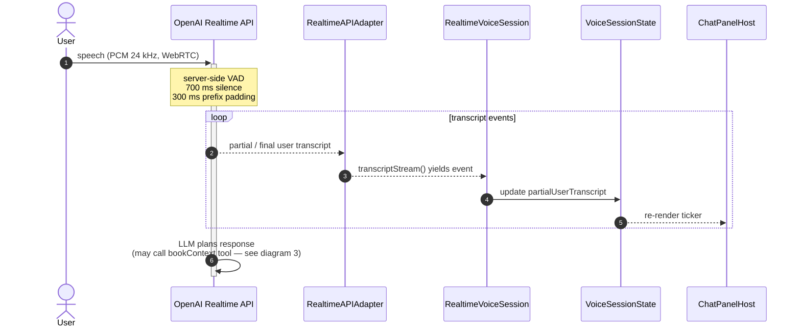
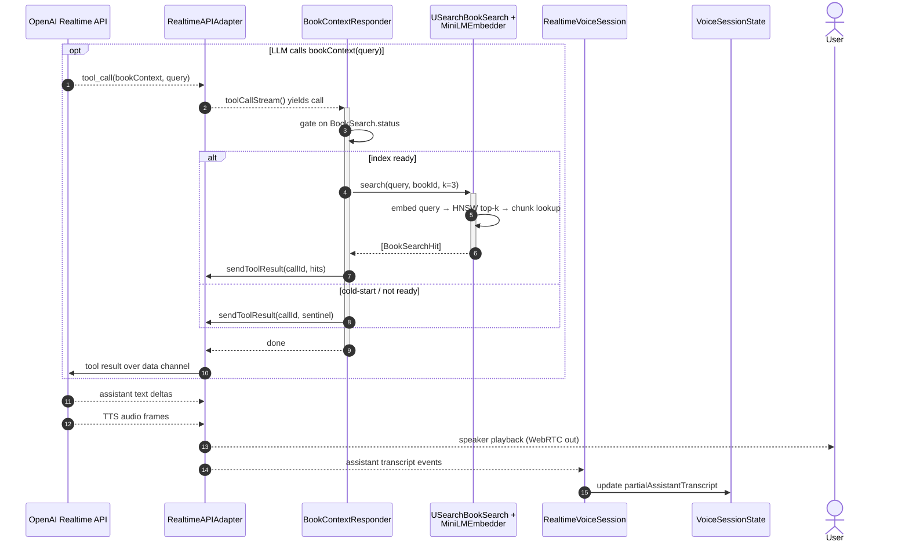
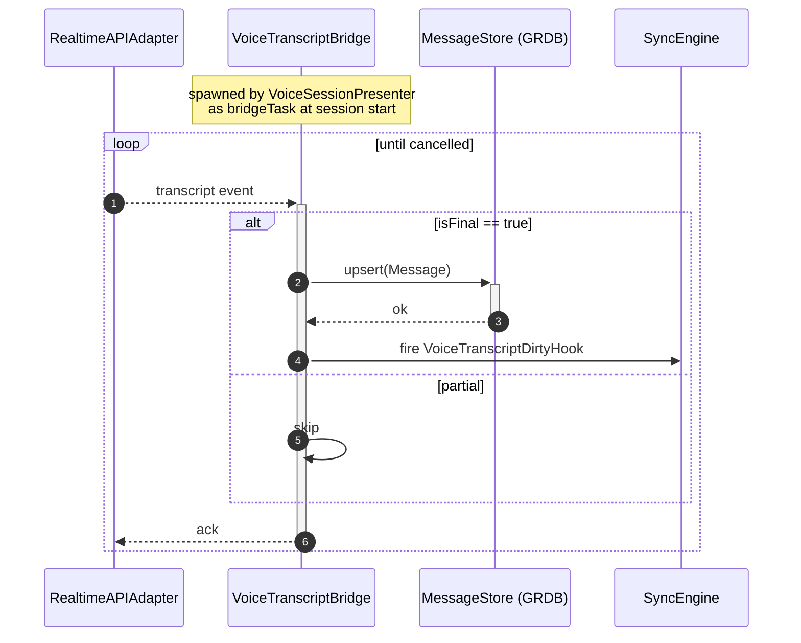
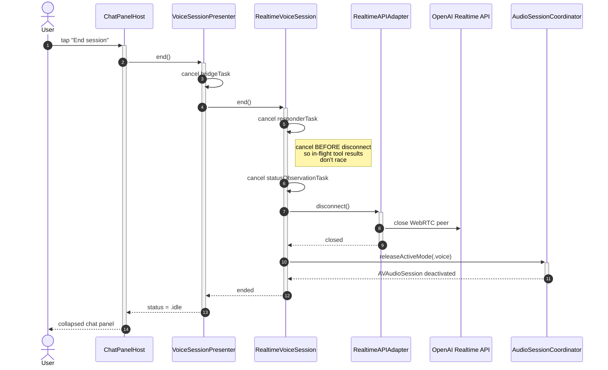

# Voice Chat Pipeline

End-to-end sequence of a voice chat session in the iOS app — from the user tapping the mic button in `ChatPanelHost` through OpenAI's Realtime API, on-device RAG against the open book, and persisted transcripts.

Broken into four diagrams by lifecycle phase:

1. [Session start](#1-session-start) — permissions, key fetch, embedder prewarm, WebRTC connect
2. [Turn — user speech → LLM](#2-turn--user-speech--llm) — server-side VAD + STT, live transcript UI
3. [Turn — RAG tool callback + response](#3-turn--rag-tool-callback--response) — `bookContext` tool call, HNSW search, TTS audio back
4. [Transcript persistence (parallel)](#4-transcript-persistence-parallel) — `VoiceTranscriptBridge` writes finalized messages
5. [Session end](#5-session-end) — ordered teardown so in-flight tool results don't race

## Participants

| Participant | File | Notes |
|---|---|---|
| `ChatPanelHost` | `rishi/rishi/Views/ChatPanelHost.swift` | SwiftUI entry, "Start voice session" button |
| `VoiceSessionPresenter` | `rishi/rishi/Voice/VoiceSessionPresenter.swift` | `@MainActor` presenter, owns `bridgeTask` |
| `RealtimeVoiceSession` | `Packages/RishiVoice/.../RealtimeVoiceSession.swift` | actor, owns `responderTask` + lifecycle |
| `AudioSessionCoordinator` | `Packages/RishiVoice/...` | `AVAudioSession` + `MicPermissionGate` |
| `EphemeralKeyFetcher` | `Packages/RishiVoice/...` | short-lived API key from worker |
| `RealtimeAPIAdapter` | `Packages/RishiVoice/.../RealtimeAPIAdapter.swift` | wraps `swift-realtime-openai` SDK |
| OpenAI Realtime API | server | server-side VAD, STT, LLM, TTS over WebRTC |
| `BookContextResponder` | `Packages/RishiVoice/Service/BookContextResponder.swift` | actor, handles `bookContext` tool |
| `USearchBookSearch` + `CoreMLMiniLMEmbedder` | `Packages/RishiSearch/...` | HNSW + on-device embeddings |
| `VoiceTranscriptBridge` | `Packages/RishiVoice/Service/VoiceTranscriptBridge.swift` | actor, persists finalized transcripts |
| `MessageStore` | GRDB-backed | chat persistence + sync hook |
| `VoiceSessionState` | `Packages/RishiVoice/State/VoiceSessionState.swift` | `@Observable` partial-transcript buffers |

---

## 1. Session start

Permissions, ephemeral key fetch, and embedder prewarm run in parallel to hide the ~500 ms CoreML cold-load behind the network round-trip. Only then does the WebRTC peer connection get established.

---

## 2. Turn — user speech → LLM

Server-side VAD on the OpenAI side decides when the user has stopped talking (700 ms silence, 300 ms prefix padding). Partial and final transcript events flow back through the SDK and update the `@Observable` state that drives the live ticker.

---

## 3. Turn — RAG tool callback + response

The LLM decides *when* to fetch book context. When it does, the SDK surfaces a `tool_call` that the `BookContextResponder` handles on-device against the open book's HNSW index. The LLM then resumes generation and the response is streamed back as both text (for the ticker) and TTS audio (played by the SDK directly).

---

## 4. Transcript persistence (parallel)

`VoiceTranscriptBridge` runs as a parallel consumer of the same transcript stream. It only writes on `isFinal=true`, so partial-transcript churn never hits disk. The `VoiceTranscriptDirtyHook` lets `SyncEngine` pick up new messages without polling.

---

## 5. Session end

Teardown order is load-bearing: `responderTask` is cancelled *before* `client.disconnect()` so it can't attempt `sendToolResult` on a closed data channel. The audio session is released last.

---

## Design notes

- **No on-device STT or TTS.** Both happen server-side in the OpenAI Realtime API. The SDK owns mic capture and speaker playback; raw PCM frames never surface to `RishiVoice`.
- **RAG is a tool callback, not a pre-prompt step.** The LLM decides when to call `bookContext(query)`; on-device search only runs on demand. This keeps cold-start cheap and lets the model issue multiple queries per turn.
- **Embedder prewarm is parallelized** with the ephemeral key fetch to hide the ~500 ms CoreML cold-load behind the network round-trip.
- **Two parallel consumers of `transcriptStream()`**: `RealtimeVoiceSession` drives live UI state, `VoiceTranscriptBridge` persists final messages. UI never blocks on disk writes.
- **Teardown ordering is load-bearing.** Cancelling `responderTask` before `client.disconnect()` prevents the responder from attempting `sendToolResult` on a closed data channel.
