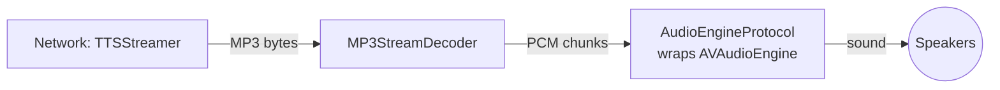
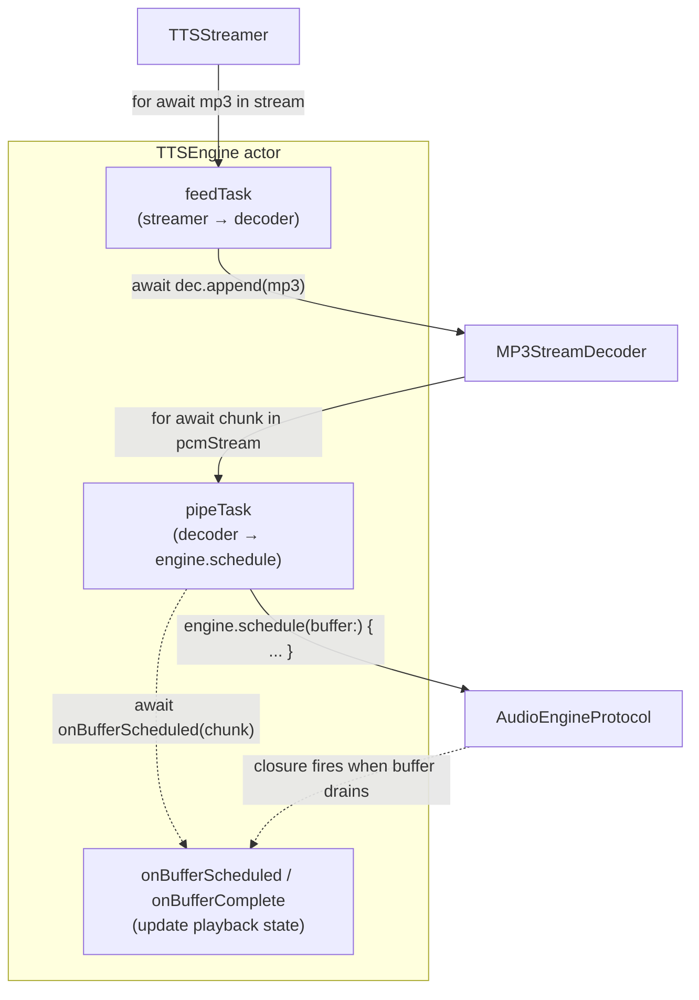
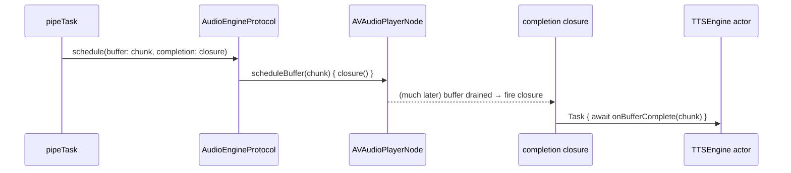
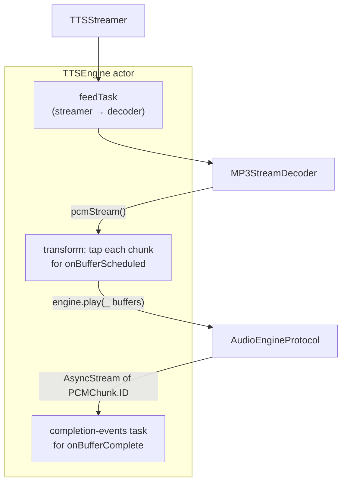
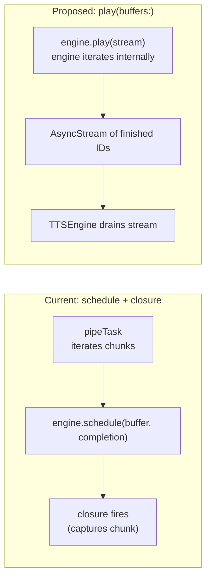

[Back to overview](../README.md)

# AudioEngineProtocol — current shape vs. `play(buffers:)` proposal

## 1. The current TTS engine

TTS playback chains three things together: a network streamer that fetches MP3 bytes, a decoder that turns those bytes into raw audio chunks (PCM), and an audio engine wrapper around `AVAudioEngine` that actually plays them. `TTSEngine` (the actor in `Packages/RishiAudio/Sources/RishiAudio/TTS/TTSEngine.swift`) is the conductor that wires them together and runs the playback session.

### The pipeline



That's the data flow. Nothing surprising — bytes in one end, sound out the other.

### How `TTSEngine` drives it

`TTSEngine.start(request:)` spins up **two long-running background tasks**:



- **`feedTask`** sits in a `for await` over MP3 bytes coming off the network and shovels each chunk into the decoder.
- **`pipeTask`** sits in a `for await` over PCM chunks coming out of the decoder. For each chunk it does two things:
  1. Hands the chunk to the audio engine via `engine.schedule(buffer: chunk) { ... }`, passing a closure the engine will call later when that specific buffer finishes playing.
  2. Calls `onBufferScheduled(chunk:)` so `TTSEngine` can update its own state (mark "first buffer started," update which passage is now playing).
- When the closure eventually fires (on some AVAudioEngine internal thread), it hops back onto the `TTSEngine` actor and calls `onBufferComplete(chunk:)`. If that was the final buffer, the session shuts down.

### What the closure is doing

The closure passed to `engine.schedule` is the bridge between "buffer is now in the engine's queue" and "buffer is done playing." Visually:



So one call (`schedule`) packs three things together:

1. **"Take this buffer."** (the imperative — please queue it)
2. **"I'll keep handing you more."** (fire-and-forget — `pipeTask` immediately loops back for the next chunk; it does not wait for the buffer to finish)
3. **"Tell me when this specific one drains."** (the closure — fires later, asynchronously, and the chunk is captured in scope so the callback already *knows which chunk*)

This is why it works well: gapless playback (multiple buffers stacked ahead of the play head), and the "which chunk finished" question is answered for free because the closure was created next to the chunk it refers to.

---

## 2. The `play(buffers:)` proposal

The idea is to hand the engine the *entire pipe* of PCM chunks and let it consume them itself. No `schedule` calls, no completion closures.

```swift
public protocol AudioEngineProtocol: Sendable {
    var targetFormat: AVAudioFormat { get }
    var isPlaying: Bool { get }
    func attach() throws
    func start() throws
    func stop()

    func play<S: AsyncSequence>(_ buffers: S) -> AsyncStream<PCMChunk.ID>
        where S.Element == PCMChunk, S: Sendable

    func pause()
    func resume()
}
```

The engine takes the sequence of chunks as input and returns a sequence of "buffer N finished" events as output. The caller iterates the output stream to know when buffers drain.

### What the pipeline looks like



And the call site:

```swift
let inspected = decoder.pcmStream().map { chunk in
    await self.onBufferScheduled(chunk: chunk)   // do bookkeeping on the way in
    return chunk
}

Task {
    for await finishedId in engine.play(inspected) {
        await self.onBufferComplete(chunkId: finishedId)
    }
}
```

`pipeTask` disappears. Instead, there's a transforming sequence that does TTSEngine's bookkeeping as chunks flow through, and a single task that drains the completion-events stream.

---

## 3. Side by side



| Question | Current shape | `play(buffers:)` shape |
|---|---|---|
| Who pulls chunks off the decoder? | `pipeTask` inside `TTSEngine` | The engine, internally |
| How is "buffer done" delivered? | Per-call closure; chunk captured in scope | Single `AsyncStream` of IDs; you look the chunk up |
| How does `TTSEngine` see each chunk going in? | Naturally — it does the loop itself | Has to insert a `.map { }` tap on the input stream |
| How do you stop playback mid-session? | Cancel `pipeTask`, then `engine.stop()` | Finish the input stream (so the engine's loop exits), then `engine.stop()` |
| What's on `AudioEngineProtocol`'s surface? | A method that takes `@Sendable @escaping () -> Void` | One method that takes an `AsyncSequence`, returns an `AsyncStream` |
| Can you schedule a single ad-hoc buffer? | Yes, trivially: one `schedule` call | Awkward — you'd wrap it in a one-element stream |
| Does `PCMChunk` need a stable ID? | No — captured by reference in the closure | Yes — that's how the completion stream identifies it |

---

## 4. How is the new one "better"

Three honest wins, none of them dramatic:

**Cleaner protocol surface.** No `@Sendable @escaping () -> Void` parameter. Under Swift 6 strict concurrency, escaping closures across actor boundaries are something the compiler tracks carefully; replacing them with `AsyncSequence`/`AsyncStream` moves the contract into types the language has first-class understanding of. Less footgun-y.

**Structured cancellation.** Today, the closure passed into `schedule` outlives `pipeTask` — once the buffer is in the engine's queue, that callback will fire whenever the audio drains regardless of whether the outer task is still alive. We handle that with `[weak self]`, but conceptually the closure is leaked into the engine. With `play(buffers:)`, the engine's consumption of chunks and the completion-event stream are both tied to the same call. Cancel the task that called `play`, and both the iteration and the event stream end together.

**The engine owns the session it's playing.** Right now `schedule` is fire-and-forget — the engine accumulates buffers and has no notion of "this session." Cleanup is the caller's job (cancel `pipeTask`, then call `stop`). With `play(buffers:)`, the engine knows when the input stream ends, so it can guarantee its own cleanup happens at the right moment. Lifecycle becomes a property of the call, not a coordination chore.

### And the costs (from earlier replies)

1. **Stopping changes shape.** Today: stop feeding chunks → cancel pipeTask. Proposed: finish the input stream or cancel the consuming task — fine, but a different mental model.
2. **Every chunk needs an ID.** The completion stream says "chunk #7 finished"; `TTSEngine` has to map that back to the actual `PCMChunk` if it needs the rest of the chunk's metadata.
3. **Visibility of "going in."** Today `pipeTask` sees every chunk before scheduling it. Proposed: you need a `.map` tap on the input stream, or a second `AsyncStream` from the engine for "started playing this one."

---

## 5. Verdict

The current design is fine. The closure shape packs scheduling, fire-and-forget, and per-buffer completion into one tiny call, and the chunk-identity question answers itself because the closure captures the chunk in scope.

`play(buffers:)` is cleaner *as a protocol surface* — no escaping closures, structured lifecycle, type-system-friendly cancellation. But the cleanup isn't free: you trade one elegant little method for a stream-in / stream-out shape, a required chunk ID, and a `.map` tap to preserve the "see each chunk going in" hook.

Worth doing if you're standardising on "no escaping closures across actor boundaries" as a codebase-wide rule, or if you find yourself fighting the closure shape (cancellation bugs, lifetime confusion). Not worth doing as a one-off taste change.

---

**Next:** [unchecked-sendable-audit.md](unchecked-sendable-audit.md) — related: where we eliminated `@unchecked Sendable` and where it stays.
