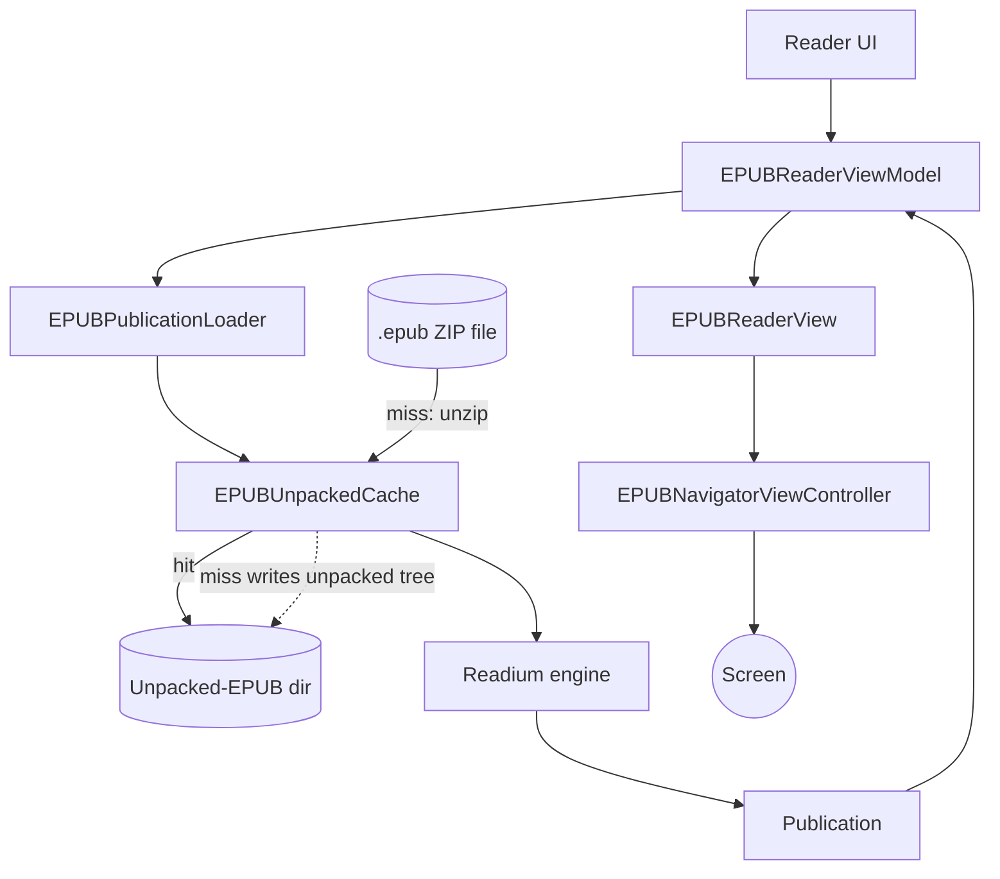

[Back to overview](../README.md)

# EPUB pipeline — current setup

The mental model for how an `.epub` file on disk turns into pages on the screen.

## Diagram

## What each node does

**Reader UI** — the screen the user landed on after tapping a book. It hosts the `EPUBReaderView` and shows a loading indicator while the publication is being prepared.

**EPUBReaderViewModel** — the controller for one open book. It owns the book's identity (which book, which file on disk, where the user was last reading), kicks off the load on first appear, and holds the resulting `Publication` so the view can render against it.

**EPUBPublicationLoader** — the "open this file" pipeline. Given a file URL, its job is to hand back a Readium `Publication` object. It uses the cache for the fast path and falls back to opening the raw ZIP if anything in the cache path fails.

**EPUBUnpackedCache** — an actor added in Phase 21. An `.epub` file is just a ZIP of HTML, CSS, images, and metadata. Readium can read it as a ZIP, but opening a ZIP every time is slow — especially on cold start. The cache unzips the book once into a directory and keeps that directory around so future opens skip the unzip entirely. Hit = use the pre-unpacked directory. Miss = unzip into the directory, then use it.

**Unpacked-EPUB dir** — a directory at `~/Library/Caches/Rishi/EPUBUnpacked/<bookId>/` holding the unzipped contents of one book. Validated against the source `.epub`'s mtime so a re-imported book invalidates cleanly. The OS may purge it under disk pressure; the next open just re-unpacks.

**.epub ZIP file** — the original book file as the user imported it. Lives in the library's books directory. The cache only touches it on a miss (to unzip from it).

**Readium engine** — the third-party library (Readium 3.9) that does the actual EPUB parsing. We give it a URL (either a directory URL on a cache hit, or the ZIP URL as fallback); it reads the manifest, the spine (reading order), and the resources, and produces a `Publication`. Under the hood this is `AssetRetriever` + `PublicationOpener` + `DefaultPublicationParser`, but you can think of it as one box: "Readium turns a file location into a Publication."

**Publication** — Readium's parsed representation of the book. Metadata (title, author, language), the reading order (which HTML files come in what sequence), table of contents, resource locations. Everything the renderer needs to draw pages and follow links.

**EPUBReaderView** — a SwiftUI view that wraps a UIKit view controller via `UIViewControllerRepresentable`. It's the bridge between SwiftUI (where the rest of the app lives) and Readium's UIKit-based renderer.

**EPUBNavigatorViewController** — Readium's own `UIViewController` that actually paints pages. It handles the heavy lifting: rendering HTML in an embedded web view, swipe gestures for page turns, fonts, themes (sepia/dark), highlights, decorations. We hand it a `Publication` and a starting locator, and it takes care of the rest. An `EPUBNavigatorCoordinator` (not on the diagram) owns the instance and holds the delegate that funnels events back to the view model.

**Screen** — what the user sees: pages of the book, turnable by swipe.

## What flows on each arrow

- **Reader UI → ViewModel**: which book to open.
- **ViewModel → Loader**: a file URL — "give me a `Publication` for this `.epub` on disk."
- **Loader → Cache**: same file URL — "is there a pre-unpacked directory for this book?"
- **Cache → Disk (hit)**: a directory URL pointing at the already-unpacked tree.
- **.epub file → Cache (miss)**: the raw ZIP bytes, which the cache unzips.
- **Cache → Disk (dotted, miss only)**: the cache writes the unpacked tree to disk so the next open is a hit.
- **Cache → Readium**: a directory URL (or the ZIP URL on fallback).
- **Readium → Publication**: a parsed `Publication` object.
- **Publication → ViewModel → View → Navigator**: the same `Publication` handed down the SwiftUI/UIKit boundary into Readium's renderer.
- **Navigator → Screen**: actual page pixels.

## What this doc deliberately leaves out

- The smaller helpers that hang off the view model — `EPUBNavigatorCoordinator` (owns the navigator instance), `EPUBPositionLocator` and `EPUBHighlightLocator` (map between user-visible positions and Readium locators), `EPUBSelectionCoordinator` (text-selection plumbing), `EPUBDecorationApplier` (highlights overlay), `EPUBPreferencesBridge` (font/theme settings), `EPUBSpreadModifier` (one-page vs. two-page layout). All exist; none are in the mental model for "how does an EPUB get on screen."
- Position restore — the loader doesn't decide where to open; the view model passes a starting locator into the navigator after the publication is ready.
- The Phase 21 prewarm path — at import time we trigger an unpack ahead of first open so the very first read is a hit, not a miss. Same cache, just populated earlier.

---

**Next:** [tts-pipeline-current.md](tts-pipeline-current.md) — the same shape of doc for text-to-speech (good companion: both pipelines use a "unpack/cache once, reuse forever" pattern at the heavy step).
