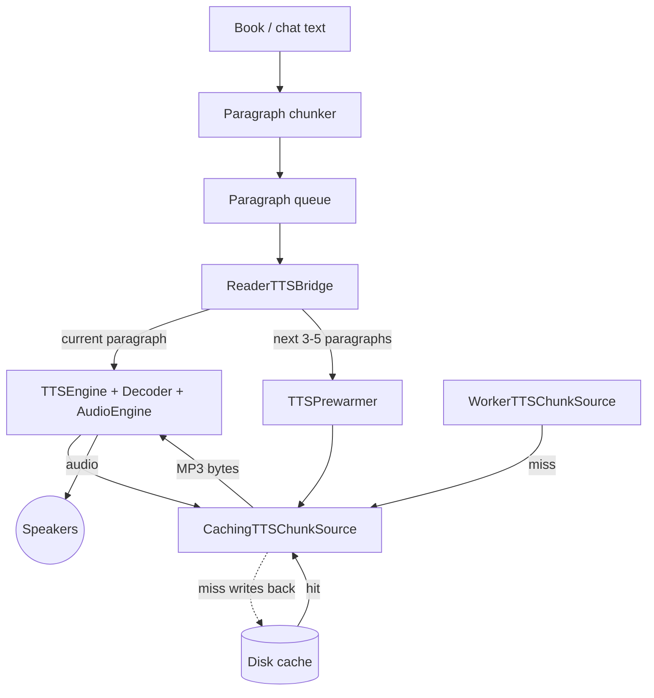

[Back to overview](../README.md)

# TTS pipeline — paragraph chunking + prewarm (proposed)

The mental model for an upgraded read-aloud pipeline. Two changes to what we have today:

1. **Chunk by paragraph, not by sentence.** Today the reader splits a page into individual sentences and sends each one as a separate `start(request:)` to `TTSEngine`. That means lots of small HTTP calls, lots of small cache entries, and an OpenAI synthesis-latency gap between every sentence on a cold passage. Paragraphs collapse all of that to one call per paragraph.
2. **Prewarm the next few paragraphs while the current one plays.** A separate "prewarmer" silently drains the same `CachingTTSChunkSource` for paragraphs ahead of the play head. The cache layer writes the MP3 to disk as a side effect. By the time the current paragraph ends, the next one is already a local disk hit — instant.

## Diagram

## What each node does

**Book / chat text** — the source content: a page of a book, a chat reply, an article. Plain text broken by paragraph boundaries (blank lines, `
` tags in EPUB content, etc.).

**Paragraph chunker** — replaces today's sentence splitter. Takes the source text and emits paragraph-sized chunks. A "paragraph" is roughly 200–1000 characters; very long paragraphs may still be subdivided at sentence boundaries to stay under OpenAI's 4096-character per-request limit. Output is an ordered list of chunks.

**Paragraph queue** — the ordered list of paragraph chunks for the current page or message, with a "current index" pointer the bridge advances.

**ReaderTTSBridge** — the orchestrator on the read-aloud side (same role it has today). It owns the queue + current index, fires playback for the current paragraph, fires prewarm for the next 3–5 paragraphs, and advances the index when the current paragraph finishes draining. New: instead of waiting until paragraph N ends to think about N+1, it kicks off prewarm for N+1 through N+5 at the same moment it kicks off playback for N. Read-ahead depth of 3–5 is the sweet spot: enough buffer that the user can never out-read the prewarmer at any realistic speech speed, small enough that the worst-case wasted synthesis (user closes the book mid-page) is bounded.

**TTSPrewarmer** (new) — a small helper that, given a paragraph, drains `CachingTTSChunkSource.stream(request:)` and discards the bytes. It does not feed a decoder or audio engine. Its only purpose is the side effect: on a cache miss, the stream triggers the worker call and the cache writes the MP3 to disk. On a cache hit, it does nothing (the file already exists). The prewarmer holds a handle to its in-flight Task so the bridge can cancel it when the user stops or jumps.

**TTSEngine + Decoder + AudioEngine** — collapsed here into one "Player" box for clarity; internally it's the same chain from the existing TTS pipeline doc (MP3 bytes → `MP3StreamDecoder` → `AudioEngine.play(_:)` → speakers). One paragraph in flight at a time. When the bridge calls `engine.start(request:)`, the player drains the cache; what comes out is decoded and played.

**CachingTTSChunkSource** — unchanged from today. The key insight enabling this whole design: it doesn't care *who* is draining its stream. The player drains it on the play path; the prewarmer drains it on the warm path. Both lookups hit the same disk cache, both misses fall through to the same worker, both write the MP3 back to disk on success. The cache is a passive shared resource.

**Disk cache** — `~/Library/Caches/Rishi/TTS/<hexkey>.mp3`, 200 MB LRU, unchanged from today. Now serves two consumers (player and prewarmer) instead of one.

**WorkerTTSChunkSource** — HTTPS client for the worker, unchanged. Whether the request was triggered by player or prewarmer makes no difference to the worker. Worker-side R2 cache (Phase 22) still applies.

**Speakers** — device output.

## What flows on each arrow

- **Text → Chunker → Queue**: text comes in, paragraph chunks come out.
- **Queue → Bridge**: the bridge reads paragraphs by index.
- **Bridge → Player**: `engine.start(request: paragraph_N)`.
- **Bridge → Prewarmer**: `prewarmer.warm(requests: [paragraph_{N+1}, paragraph_{N+2}, paragraph_{N+3}, paragraph_{N+4}, paragraph_{N+5}])`. The prewarmer drains them in order so the most-likely-next is ready first.
- **Player → Cache, Prewarmer → Cache**: two independent drains of `CachingTTSChunkSource.stream(request:)`. Each carries a request key derived from `(text, voice, speed)` — same canonical string the worker hashes.
- **Disk → Cache (hit), Worker → Cache (miss)**: same as today.
- **Cache → Disk (dotted)**: miss-path tee that writes the MP3 to a `.partial` file then atomically renames on stream end.
- **Cache → Player**: MP3 bytes for the actively playing paragraph. (The prewarmer's stream return value is discarded; only the disk-write side effect matters.)
- **Player → Speakers**: audio.

## Why this is cheaper

Today (sentence chunks):
- A page with 8 sentences = 8 HTTP calls = 8 cache entries.
- Cold pages: 8 OpenAI synthesis latencies stacked end-to-end, each ~500–2000 ms — a perceptible gap between every sentence.
- Cache fragility: any sentence-boundary change in the chunker invalidates that sentence's cache entry independently.

After (paragraph chunks + prewarm):
- A page with 3 paragraphs = 3 HTTP calls = 3 cache entries.
- Cold pages: only the *first* paragraph pays the synthesis latency. Paragraphs 2 and 3 are being warmed in the background while paragraph 1 plays; by the time paragraph 1 finishes, paragraph 2 is a disk hit (instant).
- Cache stability: paragraphs are coarser units that don't shift as easily as sentence boundaries.

The cost-per-character to OpenAI is the same either way (their rate is per-char), but you make far fewer round trips, fewer cache entries, and the user experiences ~zero gap between paragraphs after the first one.

## Knobs the bridge controls

- **Read-ahead depth**: 3–5 paragraphs. At 5 the user effectively never waits — even if they skip ahead one or two paragraphs, the destination is still inside the prewarmed window. At 3 the buffer is shorter but you waste less on closes/jumps. Tune via config; start at 5.
- **Cancellation policy**: when the user pauses, stops, or jumps non-sequentially, the bridge cancels all in-flight prewarm Tasks. The cache may still write whatever has already streamed (that's fine — even a partial future hit is a partial win), but no new prewarms start until playback resumes.
- **Worker billing**: every prewarmed paragraph that wasn't already in R2 hits the meter once. At read-ahead 5 you're paying for up to 5 paragraphs of audio the user might skip. Bounded and tunable; cheap insurance for the smooth playback experience.

## What this doc deliberately leaves out

- Implementation of the paragraph chunker (heuristics for paragraph detection in EPUB HTML vs. plain chat text vs. PDF text).
- Cancellation racing details inside `TTSPrewarmer` (Task handles, `[weak self]`, etc. — straightforward Swift Concurrency, not load-bearing for the mental model).
- The Phase 23 engine internals (`.map` tap, `ChunkLookup`, completions drain). The player box hides them; the prewarmer never touches them.
- The Cloudflare worker side. Same R2 cache as before; no worker-side change needed for this feature.

---

**Next:** [tts-pipeline-current.md](tts-pipeline-current.md) — the current state of the TTS pipeline this design upgrades. Read that first if you haven't.
