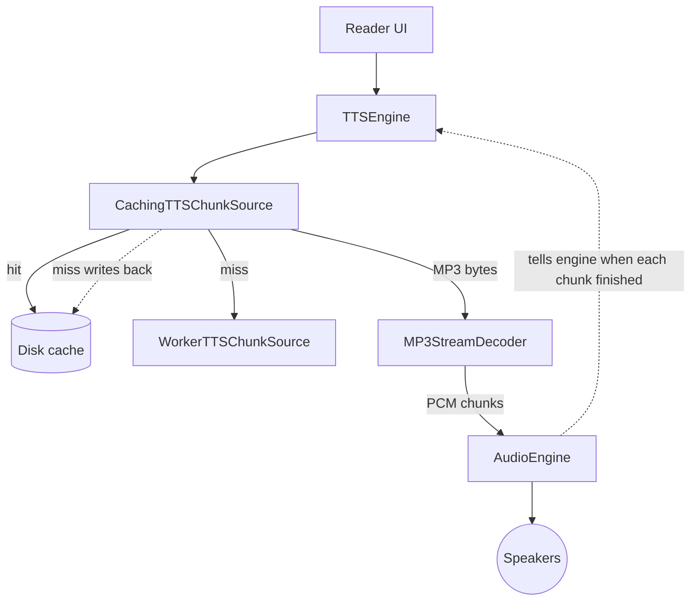

[Back to overview](../README.md)

# TTS pipeline — current setup (post Phase 22 + Phase 23)

The mental model for how a passage of text becomes audio on the iOS side.

## Diagram

## What each node does

**Reader UI** — the screen the reader is on. When the user taps "read aloud," it tells TTSEngine which passage of text to speak.

**TTSEngine** — the conductor. It's an actor that owns one playback session at a time. It asks the cache for MP3 bytes, feeds them into the decoder, hands the resulting PCM to the audio engine, and listens for completion events so it knows when to mark the next passage as "now playing" or shut the session down.

**CachingTTSChunkSource** — the cache layer added in Phase 22. When TTSEngine asks it for MP3 bytes for a given `(text, voice, speed)`, it first checks the disk. If the file is there, it streams the bytes straight from disk. If not, it calls the worker over HTTPS, hands those bytes back, **and** writes them to disk so next time is a hit.

**Disk cache** — a directory at `~/Library/Caches/Rishi/TTS/` holding one `.mp3` file per cache key. LRU-evicted at 200 MB. The OS may purge it under disk pressure, which is fine — the worker will refill it.

**WorkerTTSChunkSource** — the HTTPS client that calls our worker at `api.fidexa.org/api/audio/speech`. The worker has its own cache (a Cloudflare R2 bucket), so even a local miss often skips OpenAI. Only called on local cache miss.

**MP3StreamDecoder** — an actor that takes MP3 bytes in and produces PCM audio chunks out. PCM is the raw sample format the audio hardware actually plays. This is the only place in the pipeline where MP3 becomes PCM — so anything *upstream* of the decoder is MP3 (cacheable on disk cheaply), anything *downstream* is PCM (in-memory, per session only).

**AudioEngine** — wraps Apple's `AVAudioEngine` + `AVAudioPlayerNode`. TTSEngine hands it a stream of PCM chunks; it queues them ahead of the play head so playback is gapless, and emits a "this chunk finished" event for every chunk that drained. TTSEngine uses those events to drive UI state (mark the right passage as "now playing") and to know when the session is over.

**Speakers** — the device output. iPhone speaker, headphones, CarPlay, whatever the system routes to.

## What flows on each arrow

- **Reader UI → TTSEngine**: a request — "speak this text, in this voice, at this speed."
- **TTSEngine → Cache → (Disk or Worker)**: a request for MP3 bytes, then MP3 bytes come back.
- **Cache → Disk (dotted, miss only)**: the cache also *writes* the bytes it just fetched back to disk so the next play is a hit.
- **Cache → Decoder**: MP3 bytes.
- **Decoder → Engine**: PCM chunks, each tagged with a UUID so the engine can name which one finished.
- **Engine → Speakers**: audio.
- **Engine ⇢ TTSEngine (dotted)**: completion events — "chunk with UUID X just finished playing." TTSEngine uses these to advance UI state and to detect the final chunk so it can tear the session down.

## What this doc deliberately leaves out

- The Cloudflare worker side (R2 bucket, OpenAI fallback) — see [audio-engine-api-options.md](audio-engine-api-options.md) and the Phase 22 summary for that.
- Internal plumbing: `TTSStreamer` (a thin Log-breadcrumb wrapper between TTSEngine and Cache), the `.map` tap that records each PCM chunk so completion events can resolve UUIDs back to chunks, the `ChunkLookup` actor that holds that mapping, the separate task that drains the completion stream. All of those exist but they're TTSEngine's internal bookkeeping, not part of the mental model.

---

**Next:** [audio-engine-api-options.md](audio-engine-api-options.md) — the design memo that motivated the Phase 23 refactor (why the engine's API shape is what it is).
