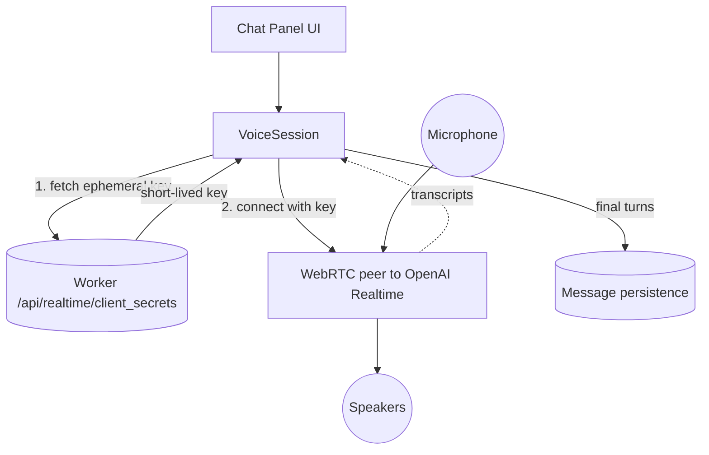

[Back to overview](../README.md)

# Voice chat pipeline — current setup

The mental model for how a tap on the voice button becomes a two-way spoken conversation with the assistant on the iOS side.

## Diagram

## What each node does

**Chat Panel UI** — the chat screen has a voice button. Tapping it asks for a voice session; while a session is live, a full-screen cover shows status, a waveform, the live transcript, and an End button.

**VoiceSession** — the conductor. One actor owns one session at a time. It drives the lifecycle (idle → connecting → live → ended), gets a key from the worker, opens the peer connection, listens for transcript events, and tears everything down on end or failure.

**Worker** — our Cloudflare worker. Called *once* per session at `/api/realtime/client_secrets` to mint a short-lived OpenAI client secret. Our infrastructure never sees the audio — only the bootstrap key.

**WebRTC peer to OpenAI Realtime** — the heart of the feature. One peer connection that carries three things at once: mic audio up, assistant audio down, and transcript events on a side channel. OpenAI runs the VAD, the STT, the LLM turn, and the voice synthesis server-side; from iOS's point of view it's a single bidirectional pipe.

**Microphone / Speakers** — system audio I/O. The peer captures from the mic and plays to the speaker directly (PCM 24 kHz both ways, no decoding on our side). The OS routes to whatever output is active (speaker, headphones, CarPlay, Bluetooth).

**Message persistence** — the chat-history store. When the peer marks a turn final, the session writes the transcript as a normal `Message` row on the conversation — same table text chat uses — so the spoken turn shows up in history once the session ends.

## What flows on each arrow

- **UI → Session**: start / end intents.
- **Session ↔ Worker**: one HTTPS round trip per session for the ephemeral key.
- **Session → Peer**: "connect with this key," then "disconnect."
- **Mic → Peer → Speakers**: raw PCM audio, full-duplex, owned by the peer.
- **Peer ⇢ Session (dotted)**: transcript events — partial fragments for the live ticker, final fragments for persistence.
- **Session → Persistence**: one row per finalized turn (user or assistant), with role + text + timestamp.

## How this differs from the TTS pipeline

The mental contrast with [tts-pipeline-current.md](tts-pipeline-current.md) is the most useful way to hold this in your head:

| | TTS | Voice chat |
|---|---|---|
| Direction | Output only | Bidirectional |
| Audio on the wire | MP3 (cacheable) | PCM (ephemeral) |
| Decoder on iOS | Yes (`MP3StreamDecoder`) | No — PCM end-to-end |
| Caching | Disk LRU + worker R2 | None |
| Worker role | Hot path, every chunk | One handshake per session |
| Audio engine owner | Our `AudioEngine` actor | Inside the WebRTC peer |
| Extra output | — | Transcripts (text → DB) |

The one shared piece is `AudioSessionCoordinator` — both pipelines route their `AVAudioSession` through it so only one mode is active at a time.

## What this doc deliberately leaves out

The diagram is a mental model, not a class map. The following are real and load-bearing in the code, but they're plumbing for one of the nodes above and don't earn their own boxes:

- **App-layer glue** — `VoiceSessionPresenter` (view-model), `ChatPanelHost` (fullScreenCover), `VoiceSessionState` (observable for the UI). All of this lives behind "Chat Panel UI."
- **Session internals** — mic permission probe (`SystemMicPermissionGate`), the 10 Hz status poll, the exponential-backoff reconnect loop (1 s / 2 s / 4 s, 3 attempts), the FSM step names. All inside "VoiceSession."
- **Peer plumbing** — `RealtimeAPIAdapter` (thin shim) and the `swift-realtime-openai` SDK's `Conversation` (the WebRTC transport). Both are "WebRTC peer to OpenAI Realtime."
- **Transcript fan-out** — `VoiceTranscriptBridge` (final → `MessageStore`, partial → state) and `AppVoiceDirtyAdapter` (notifies `SyncEngine` so the row gets pushed). All inside "Message persistence."
- **OpenAI internals** — server-side VAD (0.7 / 700 ms / 300 ms), STT, LLM, voice synthesis. To us it's one peer.
- **Worker internals** — how the ephemeral key is minted, scoped, and expired.

---

**See also:** [tts-pipeline-current.md](tts-pipeline-current.md) — the output-only sibling pipeline that shares `AudioSessionCoordinator`.
