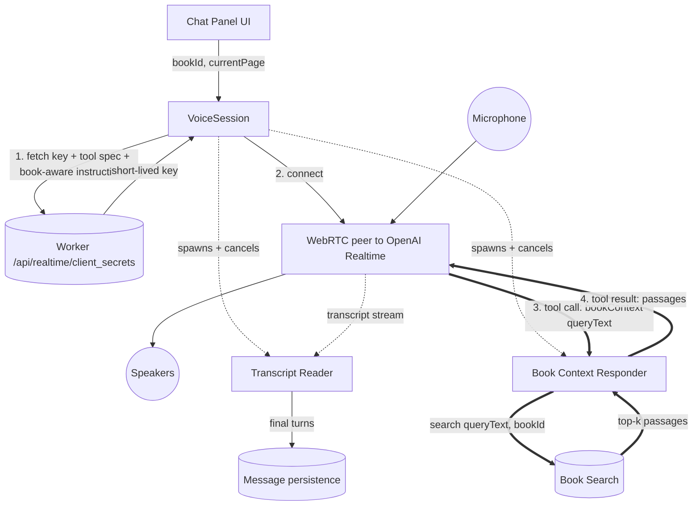

[Back to overview](../README.md)

# Voice chat pipeline — with book-aware RAG (proposed)

The mental model for the next iteration of voice chat: the assistant can look up relevant passages from the current book mid-conversation. Compare to [voice-chat-pipeline-current.md](voice-chat-pipeline-current.md) — same conductor, two small workers attached to the peer.

## Diagram

Thick arrows are the new RAG loop. Two workers (Reader, Responder) each do exactly one job; the conductor stays out of both paths.

## What each node does

**Chat Panel UI** — the chat screen's voice button. Knows the current `(bookId, currentPage)` because it's hosted inside the reader.

**VoiceSession** — the conductor, and only the conductor. Owns lifecycle, audio-session mode, the key handshake, the peer, and the reconnect loop. Spawns the Reader and Responder at connect time, cancels them at end. Doesn't touch transcripts or tool calls itself.

**Worker** — Cloudflare worker. One call per session. Returns an ephemeral key with the `bookContext` tool spec and book-aware instructions (book title, outline, current page) baked into the session config so OpenAI applies them server-side.

**WebRTC peer to OpenAI Realtime** — one peer connection carrying everything: mic up, assistant voice down, transcript events on one side channel, tool-call events on another.

**Microphone / Speakers** — system audio I/O. PCM 24 kHz both ways.

**Transcript Reader** — read-only worker. Drains the peer's transcript stream; pushes partials to the UI ticker; persists final turns as `Message` rows.

**Book Context Responder** — request/response worker. Drains the peer's tool-call stream; for each `bookContext(queryText)` call, asks Book Search for top-k passages and writes the result back to the peer.

**Book Search** — the search facade. One method: `search(queryText, bookId) → [(text, page, score)]`. Embeds the query, runs an HNSW nearest-neighbor lookup against the book's on-device vector index, returns chunks. Embedding and the HNSW index itself are internal to this node.

**Message persistence** — chat history store. Final turns land here as normal `Message` rows, same as text chat.

## What flows on each arrow

- **UI → Session**: start / end intents, plus the reader context `(bookId, currentPage)`.
- **Session ↔ Worker**: one HTTPS round trip. `(bookId, currentPage)` up; ephemeral key + tool spec + book-aware instructions down.
- **Session → Peer**: "connect," "disconnect."
- **Session ⇢ Reader, Responder (dotted)**: spawn at connect, cancel at end. The session owns their lifetime; it doesn't talk to them after that.
- **Mic → Peer → Speakers**: raw PCM audio, full-duplex.
- **Peer ⇢ Reader (dotted)**: `(role, content, isFinal)` transcript fragments.
- **Reader → Persistence**: one row per finalized turn.
- **Peer ⇒ Responder (thick)**: `bookContext(queryText)` — the assistant is asking for passages.
- **Responder ⇒ Search ⇒ Responder**: query goes in, top-k chunks come out.
- **Responder ⇒ Peer (thick)**: tool result containing the passages.

## Two design notes worth holding in the head

**Reader vs. Responder.** The two workers have different shapes by design. The Reader is one-way — it consumes from the peer and never writes back. The Responder is request/response — every tool call gets exactly one tool result written back to the peer. Same "small worker attached to a peer stream" pattern, but the naming reflects that one is a side-effect on `MessageStore` and the other is a back-channel to the peer.

**The tool spec is a shared contract.** The `bookContext` spec (parameter names, types, description) lives in `@rishi/shared`. The Worker imports it to bake into the ephemeral key. The Responder imports it to know what to expect. Changing the spec is a one-place edit that both sides pick up — no risk of the worker advertising a tool the Responder doesn't handle.

## What changes versus current voice chat

| | Current | With RAG |
|---|---|---|
| Tools declared | None | `bookContext` |
| Instructions | "You are a friendly assistant." | Book title + outline + current page + tool usage rules |
| iOS handles tool calls? | No | Yes — via the Responder |
| On-device data | None | Per-book vector index, queried via Book Search |
| Round trips during session | 1 (key) | 1 (key) + N tool calls during the conversation |
| Conductor jobs | Lifecycle + transcripts | Lifecycle only |

## What this doc deliberately leaves out

- How the book gets chunked and embedded at import time — separate indexing pipeline, fires once per book.
- Which embedding model is used and where it runs — internal to Book Search.
- HNSW build parameters, on-disk layout, eviction — internal to Book Search.
- Behavior when the index isn't ready yet — Book Search returns a defined "not ready" result; how the Responder surfaces that to OpenAI is its bookkeeping.
- The exact OpenAI Realtime event names for tool calls and results — internals of Peer ⇒ Responder ⇒ Peer.
- Reconnect behavior, cancellation propagation when the session ends mid-search — VoiceSession + Responder bookkeeping.
- The Electron tool siblings (`endConversation`, `inspectCurrentPage`) — out of scope for iOS parity here; each would be its own Responder if added.

---

**See also:** [voice-chat-pipeline-current.md](voice-chat-pipeline-current.md) — the tools-blind version, kept for contrast.
