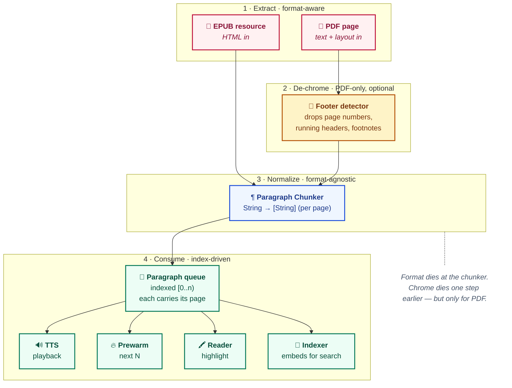
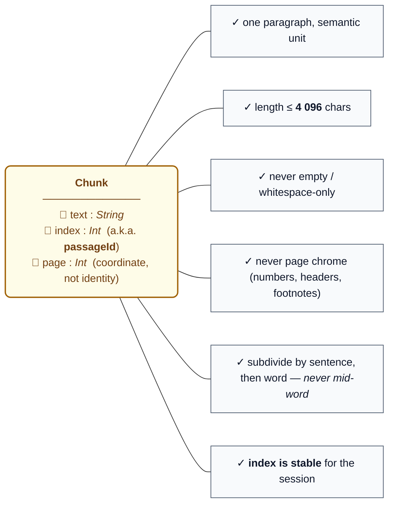
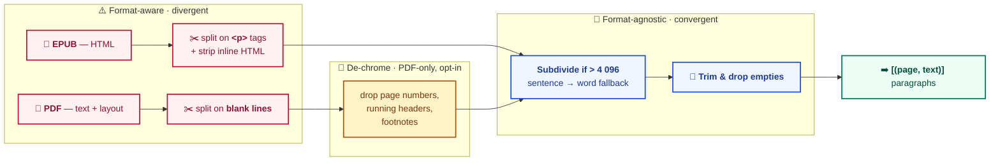
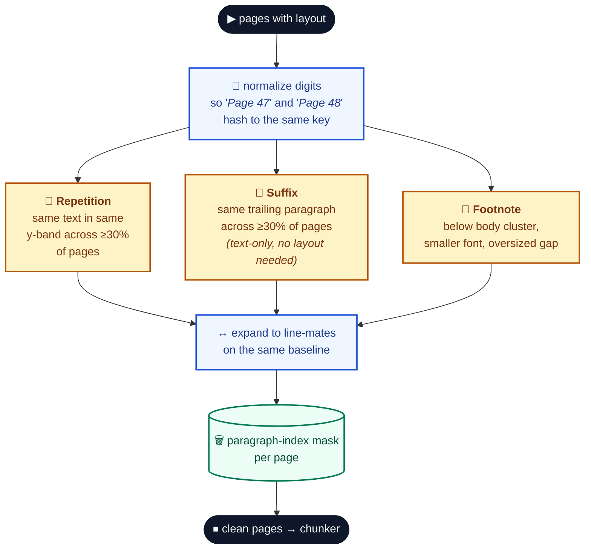
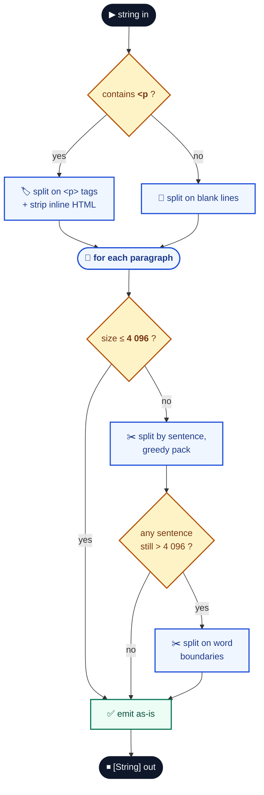
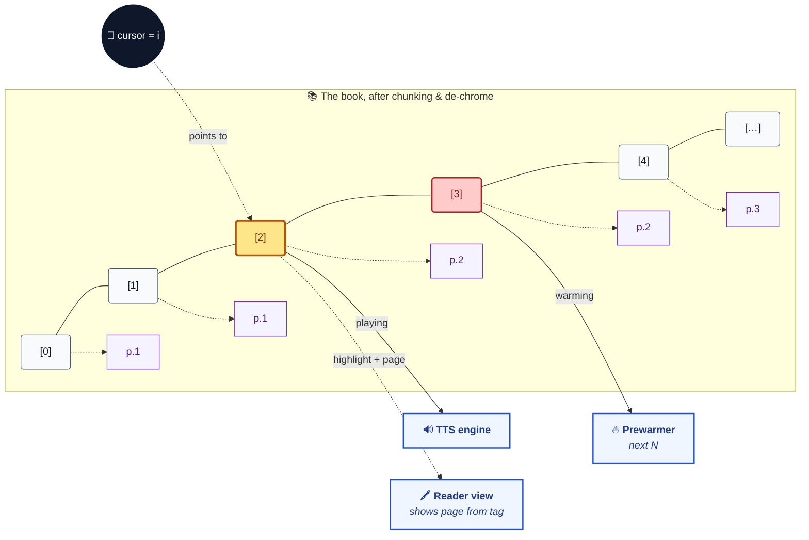
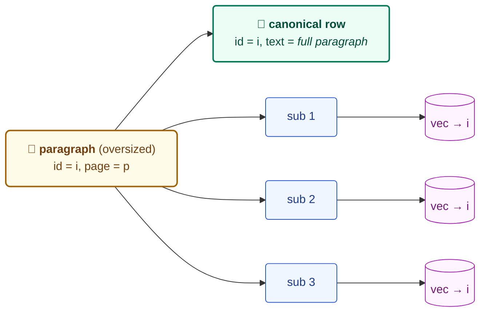

# Book Chunking — Mental Model

> Conceptual model only. No file paths, no APIs, no plumbing.

## TL;DR

A book becomes a **flat sequence of `(page, paragraph)` pairs**, indexed by position.
Everything downstream (TTS, prewarm, highlight, search) is just **index arithmetic over that sequence**, with the page number tagged along as a coordinate.

| Question | Answer |
| --- | --- |
| What is a chunk? | A paragraph. Identity = its index. Coordinate = its page. |
| Is it format-agnostic? | **Yes downstream.** Format only matters at extraction and footer detection. |
| What does the queue carry? | `[(page, text)]` plus a cursor. Nothing richer. |
| What's the size ceiling? | 4 096 chars per chunk, with sentence → word fallback. |
| What about page chrome (footers, page numbers, footnotes)? | **Stripped before chunking**, PDF-only, behind a toggle. The chunker never sees them. |
| Are sub-chunks visible? | **No.** Embedding-time subdivision is invisible to playback/highlight — only the indexer sees it. |

---

## 1. The Layers

The pipeline is four concentric responsibilities. The format dies at the chunker's doorstep; the page chrome dies just before that, but only for PDF.

**Boundary discipline**

- Layer 1 knows the format. Layer 2 only runs for PDF and is behind a policy toggle. Layer 3 and 4 do not know either.
- Layer 3 is a **pure function**: `String → [String]`.
- Layer 4 only sees a `passageId` (the index) and a page number. No paragraph object, no layout, no font info.

---

## 2. What a Chunk Is

A chunk is not a sentence, a page, or a section. It is a **paragraph with an index and a page coordinate**.

Page is a **coordinate**, not identity — two paragraphs from the same page have different indices and are different chunks. Identity is the index.

---

## 3. Format Awareness — Where It Lives

Format-specific surface area is concentrated in two places: how raw text comes out, and (for PDF only) how page chrome gets stripped before chunking. The chunker itself is shared.

**Things that do NOT know the file format**

| | Component | Sees |
| :---: | --- | --- |
| 🧵 | the queue | `[(page, text)]` + index |
| 🔊 | the TTS engine | one string at a time |
| 🔥 | the prewarmer | next N strings |
| 🔌 | the reader-to-audio bridge | indices only |
| 🖍️ | the highlight system | indices only |
| 🔎 | the search indexer | `(page, text)` tuples |

---

## 4. The Footer Detector (PDF only)

PDF has chrome that EPUB does not: page numbers, running headers, footnote blocks. If we let them through, TTS reads "Page 47" between paragraphs and search returns hits on chapter titles repeated 300 times.

The detector runs **before** chunking and emits a **mask** — a set of paragraph slots to drop per page. It does not modify text, it only marks for removal. It is behind a policy toggle and only engages when layout information is available.

**Properties**

- Three strategies vote independently; their masks are **unioned** — any one is enough to drop a paragraph.
- The mask is keyed by **paragraph slot**, not raw text. So a body paragraph that happens to end with "Page 7" is safe — only paragraphs whose normalized text matches a flagged item on the same page get dropped.
- EPUB does not go through here today. The text-only suffix strategy could in principle apply to EPUB, but it only runs alongside the layout strategies.
- The detector is **stateless and pure** — same pages in, same mask out.

---

## 5. The Chunker's Internal Decision Tree

Subdivision is a **fallback ladder**, never the primary mode. For a normal book, every chunk falls out of the first branch untouched.

---

## 6. Consumer's View — Tape, Cursor, and Page Tag

Downstream, the book is **a tape, a cursor, and a page tag riding alongside each cell**. Advance the cursor, play the chunk at it, prewarm a window ahead, show the page in the UI.

---

## 7. Indexing-Time Subdivision (Hidden from Consumers)

Search has a different size budget than TTS. The indexer may further subdivide an oversized paragraph into embedding sub-chunks — but the **canonical chunk row keeps the full original paragraph text**. Sub-vectors share the parent's identity; on retrieval they collapse back to one paragraph.

TTS, prewarm, and highlight never see the sub-chunks. They read the canonical row.

---

## Why This Shape

| Property | Pay-off |
| --- | --- |
| **Single normalized representation** | One chunker to test, one queue to reason about. |
| **Index identity** (`passageId = String(index)`) | TTS, prewarm, highlight, and search converge on a cheap integer — no shared rich model. |
| **Page as coordinate, not identity** | UI gets "what page am I on" for free; consumers that don't care can ignore it. |
| **De-chrome before chunking, mask-based** | Footer detection is a side computation that emits a drop-set. The chunker stays pure; if the detector is off, the pipeline still works. |
| **Format extension is cheap** | A new format produces text the chunker can handle. If it has chrome, it plugs into the detector independently. |
| **Indexing sub-chunks are private** | Search can use a tighter embedding window without leaking that fact to playback. |
| **Subdivision is a safety net** | Dominant case is "paragraph in, paragraph out" — preserves semantic boundaries for natural-sounding TTS. |

---

## Out of Scope for This Model

These intentionally live elsewhere:

- 📖 Reader navigation / pagination (lives in the reader VMs).
- 🎵 Audio caching, streaming, decoding (lives below the queue).
- 🎙️ Voice selection, speed (request-level metadata, not chunk-level).
- 📚 Cross-resource boundaries in EPUB (each call chunks the current resource).
- 🧠 Embedding model choice, vector store internals (sub-chunks land there, but the model doesn't matter here).
