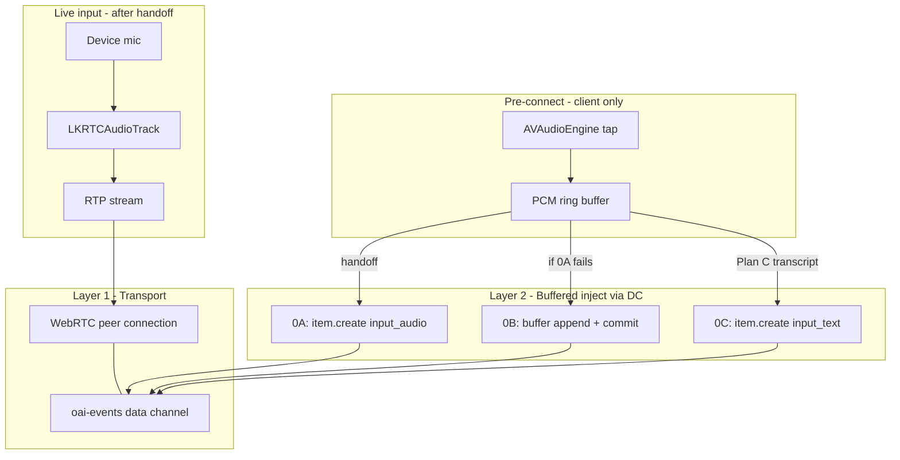

# Voice Activation PCM Handoff Implementation Plan

> **For agentic workers:** REQUIRED SUB-SKILL: use superpowers:subagent-driven-development or executing-plans. Steps use checkbox (`- [ ]`) syntax.

**Goal:** Immediate voice-chat UX — local recorder + Apple Speech VAD start on tap; Realtime WebRTC mic stays off during session init; buffered early speech is replayed into the session; then live mic takes over.

**Original architecture:** Presenter-owned `VoiceActivationCoordinator` starts capture in parallel with session bootstrap. `RealtimeVoiceSession` completes handoff after trial register-call (or legacy connect). **Transport:** WebRTC peer + `oai-events` data channel (already wired). **Pre-connect speech:** inject PCM over data channel — spike **Path A** (`conversation.item.create` + `input_audio`) first, then **Path B** (`input_audio_buffer.append` + commit); **Plan C fallback:** on-device Speech transcript → text turn. **Live speech after handoff:** RTP mic track via `enableAudioUnit()`. The remediation requirements below supersede its unacknowledged `stop → inject → enable` handoff sequence.

**Tech Stack:** Swift 6, RishiVoice, Speech framework, AVAudioEngine, swift-realtime-openai WebRTC.

**Design spec (write first):** [`apps/apple/docs/superpowers/specs/2026-07-23-voice-activation-pcm-handoff-design.md`](../specs/2026-07-23-voice-activation-pcm-handoff-design.md)

---

## Adversarial review log

### Round 1 — FAIL (Critical: 4, Important: 6)

| ID | Severity | Finding | Resolution |
|----|----------|---------|------------|
| R1-C1 | **Critical** | OpenAI Realtime **WebRTC default input is the RTP mic track**, not `input_audio_buffer.append` ([Realtime conversations guide](https://developers.openai.com/api/docs/guides/realtime-conversations): append is documented for WebSockets; WebRTC push-to-talk commits buffer filled via RTP). PCM inject is **unverified** on our transport. | Added **Task 0 spike** gate. Primary: append+clear+commit+`response.create` over data channel. **Plan B fallback:** on-device Speech transcript of buffer → `Conversation.send(from:.user, text:)` (no worker transcribe). |
| R1-C2 | **Critical** | Plan said `enableAudioUnit()` then `muted=true`. Starting WebRTC audio unit while `AVAudioEngine` records causes **dual hardware capture**; muted RTP may still confuse server VAD. | **`deferMicCapture: true`** skips `enableAudioUnit()` until handoff. `setMicCaptureEnabled(true)` = stop activation engine → `enableAudioUnit()` → `muted=false`. |
| R1-C3 | **Critical** | Trial flow handoff after `connect()` only — if register-call fails, injected audio hits an **orphan/unregistered** call. | Handoff runs **after register-call succeeds**, before control WS + `.live`. |
| R1-C4 | **Critical** | OpenAI WebRTC push-to-talk requires **`response.create` after commit** (not only server VAD auto-create). | Handoff sequence: `clear` → `append`* → `commit` → `response.create`. |
| R1-I1 | Important | `beginActivation()` placement inconsistent (diagram: presenter; body: inside `session.start()`). | **Presenter** calls `beginActivation()` immediately after `requestActiveMode(.voice)` (parallel with conversation lookup). **Session** calls `completeHandoff()` only. |
| R1-I2 | Important | `defer { await activation?.cancel() }` is not valid Swift async cleanup. | Use explicit `cancel()` on every failure/teardown path + `ActivationScope` helper if needed. |
| R1-I3 | Important | Plan lived in `.cursor/plans/` only; repo convention is `apps/apple/docs/superpowers/plans/`. | This file is canonical. |
| R1-I4 | Important | PCM format unspecified (int16 LE vs float32). | **24 kHz mono PCM16 little-endian**; verify in spike + unit test. |
| R1-I5 | Important | Reconnect `connect()` must not defer mic or re-run handoff. | ReconnectController unchanged; `deferMicCapture` defaults `false`; activation coordinator not consulted on reconnect. |
| R1-I6 | Important | Speech permission separate from mic (`NSSpeechRecognitionUsageDescription`). | Request in `beginActivation()`; denied → `EnergyVADMonitor` fallback. |

### Round 2 — PASS WITH NOTES (0 Critical, 2 Notes)

| ID | Severity | Finding | Resolution |
|----|----------|---------|------------|
| R2-N1 | Note | Park/resume already implemented — activation must not run on resume. | Explicit guard in presenter `start()` before `beginActivation()`. |
| R2-N2 | Note | `VoiceSessionPresenter` recreates `RealtimeVoiceSession` each start — coordinator stays presenter-owned, passed into session init. | Documented in Task 4. |

### Round 3 — PASS WITH NOTES (0 Critical, 1 Note) — post OpenAI docs research

| ID | Severity | Finding | Resolution |
|----|----------|---------|------------|
| R3-N1 | Note | Primary handoff candidate was `input_audio_buffer.append` (R1-C1). OpenAI docs explicitly document **`conversation.item.create` + `input_audio`** for full audio recordings on **both WebRTC data channel and WebSocket**. Append examples are WebSocket-primary; WebRTC PTT fills buffer via live RTP, not append. | Task 0 spike reordered: **0A item.create first**, 0B append second, 0C text baseline. Task 2 `injectBufferedInputAudio` implements winning path. |

**Historical review verdict: PASS WITH NOTES — safe to implement after Task 0 spike passes or fallback is chosen.**

### Implementation audit — 2026-07-23 (FAIL)

**Current verdict: FAIL — remediation is required before this handoff can ship.** This audit preserves the review history above and records that the implementation diverged from the plan's gates and invariants.

- **Task 0 was not performed.** The required live OpenAI transport spike remains unchecked, but Task 2's PCM injection implementation proceeded.
- **Capture is not immediate.** `beginActivation()` awaits Speech authorization before starting the recorder, so the first-use permission prompt loses the early utterance.
- **The Energy VAD fallback drops all speech.** Handoff stops the monitor before inspecting `everSpoke`, while `EnergyVADMonitor.stop()` clears that state. A Speech-recognizer start failure also cancels activation rather than falling back to Energy VAD.
- **The transport fallback is not operative.** The adapter picks 0A or 0B by payload size and data-channel writes do not synchronously reveal server rejection; a rejected 0A therefore cannot reliably reach 0B or Plan C.
- **Speech-end waiting can hang.** The continuation's installation and signalling are not synchronized as one atomic protocol, allowing a lost wakeup.

See the [implementation audit in the design spec](../specs/2026-07-23-voice-activation-pcm-handoff-design.md#implementation-audit--2026-07-23) for the required repair contract and current test-coverage limitation.

### Remediation requirements — diagram review (2026-07-23)

The diagram makes the cutover rule stricter than the original sequence: a connected WebRTC session is not live input ownership. The session becomes `.live` only when a buffered turn has a correlated server acceptance outcome and the RTP mic is armed.

- **Generation fence:** Every activation has an `ActivationID`. `cancel`, failure, replacement, end, and session-generation changes invalidate it. After every `await`, the coordinator and session must verify that it is still current before injecting audio, changing mic/output state, or marking `.live`.
- **Capture-owner boundary:** Change owners only at a VAD-confirmed silence. If speech restarts before RTP is armed, retain local capture, close/queue another local segment, and repeat handoff; never silently discard it. Reconcile `maxBufferSeconds` with the 15 s handoff timeout, or explicitly document and enforce a maximum utterance/loss policy. Test continuous speech and a second utterance during handoff.
- **Input and output gate:** Before handoff completes, do not issue a response except for an accepted buffered turn and do not play assistant audio. Enable remote output only with the RTP mic at the final live transition.
- **Fallback honesty:** Energy VAD can detect speech but cannot provide a Plan C transcript. On PCM rejection with no usable transcript, surface recoverable retry copy and arm the normal live mic; do not claim a text fallback occurred.
- **Lifecycle failures:** Define one terminal pre-live path for interruption, route/input changes, media-services reset, recorder failure, and audio-unit enable failure: invalidate the activation, clear local state, keep RTP/output disabled, and present retry.
- **Observability and privacy:** Emit activation ID, timing, buffer duration/bytes, VAD result, handoff path, acceptance outcome, and cutover gap. Never log PCM or transcript content.

### Startup-latency follow-up — 2026-07-23

The voice-activation handoff remains gated by the implementation audit above, but the connection critical path was optimized independently. These changes are intentionally separate from the unverified PCM handoff:

- `perf: instrument voice startup phases` adds monotonic phase timing without logging audio, book text, or provider IDs.
- `perf(voice): unblock trial startup on registration` exposes the transport as soon as WebRTC is ready; call-ID registration remains fail-closed in the background.
- `perf: mint complete realtime session config` moves the complete Realtime configuration to the ephemeral secret, eliminating the initial duplicate `session.update`.
- `perf: remove realtime startup round trips` replaces readiness polling with buffered transport/session events.
- `perf(voice): avoid initial session readiness stall` trusts the server-minted initial configuration after the data channel opens; reconnects still validate their refreshed snapshot.
- `perf(voice): skip duplicate startup preflight` avoids repeating microphone permission and audio-session setup after the presenter has already completed them.
- `perf(voice): overlap session admission and mint` overlaps the independent ledger admission and OpenAI secret mint after allowance freshness is established.
- `perf(voice): prewarm realtime peer during session setup` constructs the disconnected WebRTC peer while the worker creates the session; no network negotiation or audio capture starts during prewarm.

The remaining setup cost is now observable as `voice.startup.phase` timings. The live OpenAI PCM acceptance spike, activation lifecycle hardening, and app-level device smoke test are still required before enabling pre-session capture.

---

## How we connect to OpenAI Realtime

Connection has **two layers**: transport (WebRTC peer) and audio input path.

### Layer 1 — Transport (what we already do)

1. Create peer + local audio track + `oai-events` data channel → [`WebRTCConnector.create()`](../../Packages/swift-realtime-openai/Sources/WebRTC/WebRTCConnector.swift)
2. POST SDP to `POST /v1/realtime/calls` → handshake complete
3. Register call with Worker (trial flow)
4. Send/receive control events over data channel → [`WebRTCConnector.send(event:)`](../../Packages/swift-realtime-openai/Sources/WebRTC/WebRTCConnector.swift)

This gives a live session. It does **not** solve early speech during connect.

### Layer 2 — Audio input paths

OpenAI does **not** connect to our `AVAudioEngine`. It only receives audio via:

| Path | Mechanism | When |
|------|-----------|------|
| **Live mic (default)** | Device mic → `LKRTCAudioTrack` → RTP | Normal turns after handoff |
| **0A — Full audio turn** | `conversation.item.create` + `input_audio` (base64 PCM16 24kHz mono) → `response.create` | **Primary spike** — retroactive buffered speech |
| **0B — Buffer stream** | `input_audio_buffer.clear` → `append`* → `commit` → `response.create` | Secondary spike — WebSocket-style |
| **0C — Text turn** | `conversation.item.create` + `input_text` → `response.create` | Fallback (Electron [`activation-program.ts`](../../../../packages/shared/src/voice-chat/activation-program.ts)) |

Docs: [Realtime conversations — audio input](https://developers.openai.com/api/docs/guides/realtime-conversations), [Realtime WebRTC — data channel events](https://developers.openai.com/api/docs/guides/realtime-webrtc).



### Our wiring today

- [`WebRTCConnector`](../../Packages/swift-realtime-openai/Sources/WebRTC/WebRTCConnector.swift) always adds local audio track at peer creation. Mute = `audioTrack.isEnabled`.
- [`WebRTCAudioUnitController`](../../Packages/RishiVoice/Sources/RishiVoice/Service/WebRTCAudioUnitController.swift) gates hardware capture via `LKRTCAudioSession.isAudioEnabled`. `enableAudioUnit()` starts mic I/O.
- SDK types for `inputAudio` exist in [`Item.swift`](../../Packages/swift-realtime-openai/Sources/Core/Models/Item.swift); [`Conversation.send(from:text:)`](../../Packages/swift-realtime-openai/Sources/UI/Conversation.swift) only exposes text today — add `sendUserAudio()` helper in Task 2 if 0A wins.
- Inject payload format: **PCM16 LE, 24 kHz, mono, base64** — matches [`RealtimeSessionConfigBuilder`](../../Packages/RishiVoice/Sources/RishiVoice/Service/RealtimeSessionConfigBuilder.swift).

### What will NOT work

| Approach | Why |
|----------|-----|
| Enable RTP early, muted | Sends silence — no retroactive recovery |
| Server VAD during connect | No RTP reaches server while `enableAudioUnit()` deferred |
| WebRTC + AVAudioEngine mic simultaneously | Dual capture; session conflicts (R1-C2) |
| Custom WebRTC audio source replay | Undocumented; heavy iOS engineering |

### Activation connect model (summary)

**During connect window:** peer + data channel up; `deferMicCapture=true` (skip `enableAudioUnit()`); record locally via activation `AVAudioEngine`.

**At handoff (after register-call):** stop activation engine → inject via data channel (0A or 0B) → **then** `setMicCaptureEnabled(true)` for live RTP mic.

---

## Problem

Mic capture today starts only at the end of [`RealtimeAPIAdapter.connect()`](../../Packages/RishiVoice/Sources/RishiVoice/Service/RealtimeAPIAdapter.swift) via `enableAudioUnit()`. During the 1–3+ s connect window, early speech is lost. The updated architecture:

1. **Apple Speech recorder** — local PCM ring buffer from tap
2. **Apple Speech VAD** — detect whether user spoke (not the handoff decision alone)
3. **Block Realtime** from consuming audio until handoff completes
4. **Replay** buffered speech into the session, then unmute for normal turns

---

## Target behavior

```mermaid
sequenceDiagram
    participant User
    participant Presenter as VoiceSessionPresenter
    participant Activation as VoiceActivationCoordinator
    participant Recorder as ActivationAudioRecorder
    participant VAD as SpeechVADMonitor
    participant Session as RealtimeVoiceSession
    participant Adapter as RealtimeAPIAdapter
    participant RT as OpenAI_Realtime

    User->>Presenter: tap voice
    Presenter->>Presenter: isPresenting=true
    Note over Presenter: skip if park/resume
    Presenter->>Presenter: requestActiveMode(.voice)
    Presenter->>Activation: beginActivation()
    Activation->>Recorder: start PCM ring buffer
    Activation->>VAD: start Speech VAD on same tap

    par Session bootstrap
        Presenter->>Session: start()
        Session->>Adapter: connect(deferMicCapture=true)
        Adapter->>RT: WebRTC peer up, no audio unit yet
        Session->>Session: register-call (trial)
    and User speaks early
        User->>Recorder: PCM frames
        VAD->>VAD: everSpoke=true
    end

    Session->>Activation: completeHandoff(client)
    alt everSpoke
        Activation->>VAD: waitForSpeechEnd(timeout)
        Activation->>Recorder: stop, snapshot buffer
        Activation->>Adapter: inject PCM via data channel
        Note over Adapter,RT: Spike 0A: item.create input_audio
        Note over Adapter,RT: else 0B: append+commit; else 0C: text
        Adapter->>RT: response.create
    else never spoke
        Activation->>Recorder: stop
    end
    Activation->>Adapter: setMicCaptureEnabled(true)
    Note over Adapter: stop activation engine first; then enableAudioUnit + unmute RTP
    Session->>Session: status=.live
```

**Scenario A:** speak before session ready → buffer + block Realtime → handoff → live mic.

**Scenario B:** speak after `.live` → server VAD (0.7 / 700 ms) as today.

---

## Task 0: WebRTC audio inject spike (gate)

**Files:** scratch test in `RishiVoiceTests` or manual spike against real OpenAI session

**Setup:** Connect with `deferMicCapture=true` (peer up, data channel open, no `enableAudioUnit()`). Use known PCM16 24 kHz mono sample (tone or recorded speech).

**Acceptance semantics:** A local data-channel write is not success. Each path must use a client-generated item/turn ID and wait for the correlated server acceptance event (or a bounded terminal outcome) before the coordinator advances. On an explicit, correlated rejection, try the next path. On timeout or ambiguous delivery, do not blindly retry: the first turn may already have been accepted, so show recoverable retry instead.

**Production-size matrix:** Test 100 ms chunks and the maximum configured buffer (8 s PCM16/24 kHz/mono ≈ 384 KB), server/data-channel size limits, response timing, rejection/timeout handling, reconnect/disconnect mid-inject, and duplicate-turn prevention. Record the actual event names and correlation strategy in the design spec.

**Test matrix — record outcome in spec:**

| # | Inject method | Pass criteria |
|---|---------------|---------------|
| **0A** | `conversation.item.create` + `input_audio` + `response.create` | `conversation.item.created` + `response.done` with sensible reply |
| **0B** | `input_audio_buffer.clear` → `append`* (100ms chunks) → `commit` → `response.create` | Same |
| **0C** | `send(from:.user, text:)` with known transcript | Same (baseline fallback) |

- [ ] Run **0A** first (primary candidate per OpenAI "Send full audio messages" docs)
- [ ] If 0A receives an explicit correlated rejection, run **0B**
- [ ] Run **0C** as baseline
- [ ] Record winning path in spec

**Decision tree:**

- 0A has correlated acceptance → Task 2 implements **item.create + input_audio** path; add SDK helper `Conversation.sendUserAudio(_:)`
- 0A has explicit correlated rejection, 0B has correlated acceptance → Task 2 implements append + commit path
- Both have explicit rejection → use Plan C only when a usable transcript exists; otherwise implement recoverable retry with normal live mic
- Any ambiguous result → do not retry automatically or select a PCM winner

**Do not proceed to Task 2 until Task 0 outcome is recorded in the spec.**

---

## Task 1: Design spec + Activation module

**Create:** `Packages/RishiVoice/Sources/RishiVoice/Activation/`

| Type | Responsibility |
|------|----------------|
| `VoiceActivationConfig` | `hangoverMs=700`, `maxBufferSeconds=8`, `handoffTimeoutMs=15000`, `appendChunkMs=100` |
| `ActivationState` / `ActivationID` | States `idle`, `capturing`, `waitingForSilence`, `injecting`, `armingLiveMic`, `live`, `cancelled`, `failed`; fences stale async continuations. |
| `HandoffOutcome` | `accepted(path)`, `noSpeech`, `unavailable`, `rejected`, `ambiguous`, `interrupted`; makes every fallback outcome explicit. |
| `SpeechVADMonitoring` | Protocol: `start()`, `stop()`, `everSpoke`, `waitForSpeechEnd(timeout:)` |
| `SpeechVADMonitor` | `SFSpeechRecognizer` + buffer request; first partial → `everSpoke`; hangover/final → end. On-device only; a usable transcript may support Plan C. |
| `EnergyVADMonitor` | RMS fallback when Speech auth/recognizer unavailable |
| `ActivationAudioRecorder` | Single `AVAudioEngine` tap → rolling PCM ring (~8 s cap) |
| `PCM24kConverter` | Device-rate float → **PCM16 LE 24 kHz mono** |
| `VoiceActivationCoordinator` | Actor: `beginActivation()`, `completeHandoff(client:)`, `cancel()` |

**Invariants:**

- One engine, one tap (recorder + Speech share buffers)
- `completeHandoff`: wait for a silent boundary → inject queued local segments → await correlated terminal outcomes → release local recorder → arm RTP mic/output
- `cancel()`: stop engine, discard buffer, idempotent

**Remediation invariants:**

- Preflight microphone permission before creating an activation. Once granted, start the recorder immediately; never await Speech authorization before capture. If permission was just granted, require a fresh tap/retry rather than claiming speech during the OS prompt was captured.
- Start Speech VAD best-effort alongside the recorder. Denied, unavailable, or failed Speech startup switches to Energy VAD. Read `everSpoke` before reset/stop, and make VAD wait registration/signalling atomic.
- Recorder ownership ends only at a silent boundary after the current local segments are accepted, or after the recovery path explicitly takes over. Speech that restarts before cutover creates another queued local segment; it is not dropped.
- Before `.live`, interruption, route/input change, media-services reset, recorder failure, or audio-unit failure invalidates the generation, clears the buffer, keeps RTP/output disabled, and exposes retry.

- [ ] Write spec at `apps/apple/docs/superpowers/specs/2026-07-23-voice-activation-pcm-handoff-design.md` — include **OpenAI audio input research appendix** (from § "How we connect to OpenAI Realtime" above) and Task 0 spike results when available
- [ ] Unit tests: converter, coordinator with fakes, VAD never-spoke / spoke-wait-inject ordering

---

## Task 2: RealtimeClientAPI + Adapter seams

**Modify:** [`RealtimeClientAPI.swift`](../../Packages/RishiVoice/Sources/RishiVoice/Service/RealtimeClientAPI.swift), [`RealtimeAPIAdapter.swift`](../../Packages/RishiVoice/Sources/RishiVoice/Service/RealtimeAPIAdapter.swift), [`FakeRealtimeClient.swift`](../../Packages/RishiVoice/Tests/RishiVoiceTests/Fakes/FakeRealtimeClient.swift)

Add to protocol (default args preserve reconnect call sites):

```swift
func connect(..., deferMicCapture: Bool = false) async throws
func setMicCaptureEnabled(_ enabled: Bool) async
func injectBufferedInputAudio(_ pcm16le24kMono: Data, activationID: ActivationID) async throws -> HandoffAcceptance
func setAssistantOutputEnabled(_ enabled: Bool) async
```

**Adapter behavior:**

- `connect(deferMicCapture: true)`: full WebRTC + session config + pumps; **skip** `enableAudioUnit()`
- `setMicCaptureEnabled(true)`: stop activation engine (caller/coordinator) → `enableAudioUnit()` → `convo.muted = false`
- `setMicCaptureEnabled(false)`: no-op if unit not enabled
- `injectBufferedInputAudio`: resolve only after correlated server acceptance and expose explicit rejection, timeout, or ambiguous delivery—not merely completion of `dataChannel.send`.
  - **0A:** `createConversationItem(.message(..., content: [.inputAudio(...)]))` + `createResponse()` via data channel
  - **0B:** only after explicit correlated 0A rejection, `clear` + `appendInputAudioBuffer`* + `commit` + `createResponse()`
  - **Plan C:** only with a usable Speech transcript; otherwise return a recoverable no-transcript outcome
- Gate assistant output while mic capture is deferred. Do not issue a second `response.create` until the prior turn's acceptance semantics show it was not accepted.
- Consider SDK helper on `Conversation`: `sendUserAudio(_ pcm16le24kMono: Data)` wrapping item.create + response.create

- [ ] Adapter unit test: deferMicCapture skips enableAudioUnit; inject calls ordered correctly
- [ ] Fake tracks defer/inject/mic flags for session tests

---

## Task 3: Wire RealtimeVoiceSession

**Modify:** [`RealtimeVoiceSession.swift`](../../Packages/RishiVoice/Sources/RishiVoice/Service/RealtimeVoiceSession.swift)

**Initial connect only** (trial + legacy):

1. `connect(deferMicCapture: activation != nil)` with assistant output gated.
2. Trial: call `completeHandoff` after register-call success. Legacy: call it after connect success. Pass the current session and activation generation.
3. At a silent boundary, inject a complete queued local segment and wait for correlated acceptance. If speech resumes before cutover, keep recording and queue the new segment rather than enabling RTP through it.
4. At a silent boundary after all queued pre-live segments are accepted: stop activation recorder → enable audio unit + RTP mic and assistant output → revalidate generation → `.live` + reconnect observation.
5. On rejection, ambiguous transport, unavailable transcript, interruption, or failure: do not mark `.live` until the explicit user-visible recovery path completes. All terminal paths invalidate the activation generation.

**Skip activation when:** coordinator nil (tests), or presenter resumed parked session.

**Reconnect:** unchanged — `ReconnectController` uses default `deferMicCapture=false`; no handoff.

- [ ] Extend `RealtimeVoiceSessionTests` for defer + handoff-before-live ordering
- [ ] State-machine tests: cancellation, failure, replacement, and end after every suspension point cannot inject audio, enable mic/output, or reach `.live`.
- [ ] Handoff tests: uninterrupted max-buffer speech, speech restarted during injection, no-speech, and ownership transfer with an explicit cutover-gap budget.

---

## Task 4: Wire VoiceSessionPresenter

**Modify:** [`VoiceSessionPresenter.swift`](../../../rishi/rishi/Voice/VoiceSessionPresenter.swift)

- Presenter owns **one** `VoiceActivationCoordinator` (not recreated per session)
- After `requestActiveMode(.voice)`, unless resuming parked session: `await activation.beginActivation()`
- Preflight microphone permission before activation. If it was just granted, require a fresh Start voice action before beginning capture; do not promise recovery of speech spoken during the permission prompt.
- Pass coordinator into each new `RealtimeVoiceSession`
- `requestEnd()` / `clearFailure()`: `await activation.cancel()`

**Modify:** [`rishi.xcodeproj/project.pbxproj`](../../../rishi/rishi.xcodeproj/project.pbxproj) — add `NSSpeechRecognitionUsageDescription`

- [ ] Extend `VoiceSessionPresenterParkTests` — resume skips `beginActivation`

---

## Task 5: Docs + build gate

- [ ] Update [`VOICE-CHAT-PIPELINE.md`](../../VOICE-CHAT-PIPELINE.md) §1 with activation phase
- [ ] `swift test --package-path apps/apple/Packages/RishiVoice`
- [ ] `xcodebuild -scheme rishi -destination 'platform=iOS Simulator,name=iPhone 17' build`
- [ ] Manual smoke: tap voice → speak during Connecting → full first utterance, no duplicate/overlap
- [ ] Permission and lifecycle tests: first-use mic/Speech denial, recognizer startup failure, route/interruption/media-services reset, recorder failure, and audio-unit enable failure.
- [ ] Live transport spike: maximum payload, correlated acceptance, explicit 0A rejection → 0B, ambiguous delivery avoids duplicate turns, and no-transcript recovery behavior.
- [ ] Telemetry test: structured activation events contain no PCM or transcript content.
- [ ] Document the ownership state diagram, cutover-gap budget, and user-visible retry copy in `VOICE-CHAT-PIPELINE.md`.

---

## Edge cases

| Case | Behavior |
|------|----------|
| Never speaks during connect | Skip inject; enable mic immediately |
| Spoke, silent at handoff | Inject buffer; enable mic |
| Mid-sentence at handoff | Wait hangover; inject full buffer; enable mic |
| Handoff timeout | Treat as a terminal transport outcome. If delivery is ambiguous, do not retry automatically; show recoverable retry rather than injecting a potentially duplicate partial turn. |
| Speech permission denied | Energy VAD fallback. If it cannot start, show retry and arm live mic without claiming the pre-live utterance was preserved. |
| First-use microphone permission | Show permission/retry; speech before OS grant is unrecoverable and must not be promised. |
| Speech unavailable or denied | Use Energy VAD for PCM paths; use Plan C only with a usable transcript. |
| PCM rejected and no usable transcript | Show “I missed that—please repeat”, then arm live mic; never fabricate a text fallback. |
| Speech resumes during handoff | Keep recording and queue another segment; defer RTP cutover until silence. |
| Ambiguous or timeout transport result | Do not retry automatically or enable a potentially duplicate turn; show recoverable retry. |
| Audio interruption/route/reset before live | Invalidate activation, keep RTP/output disabled, clear buffer, request retry. |
| Assistant output before handoff | Suppress it until buffered-turn acceptance and final live cutover. |
| Task 0 spike: 0A and 0B fail | Plan C: Speech transcript → text turn |
| Cancel mid-connect | cancel activation; disconnect; no mic enable |
| Reconnect while live | No activation |
| Park/resume ≤3 min | No activation ([`parkSession()`](../../../rishi/rishi/Voice/VoiceSessionPresenter.swift)) |

---

## Out of scope

- Worker `/api/audio/transcribe` replay
- Cascade/hybrid SpeechAnalyzer (Phase 2 hybrid plan)

---

## File map

| File | Action |
|------|--------|
| `RishiVoice/Activation/*` | Create |
| `RealtimeClientAPI.swift` | Modify |
| `RealtimeAPIAdapter.swift` | Modify |
| `RealtimeVoiceSession.swift` | Modify |
| `VoiceSessionPresenter.swift` | Modify |
| `FakeRealtimeClient.swift` | Modify |
| `VOICE-CHAT-PIPELINE.md` | Modify |
| `specs/2026-07-23-voice-activation-pcm-handoff-design.md` | Create |
| `rishi.xcodeproj/project.pbxproj` | Modify |
