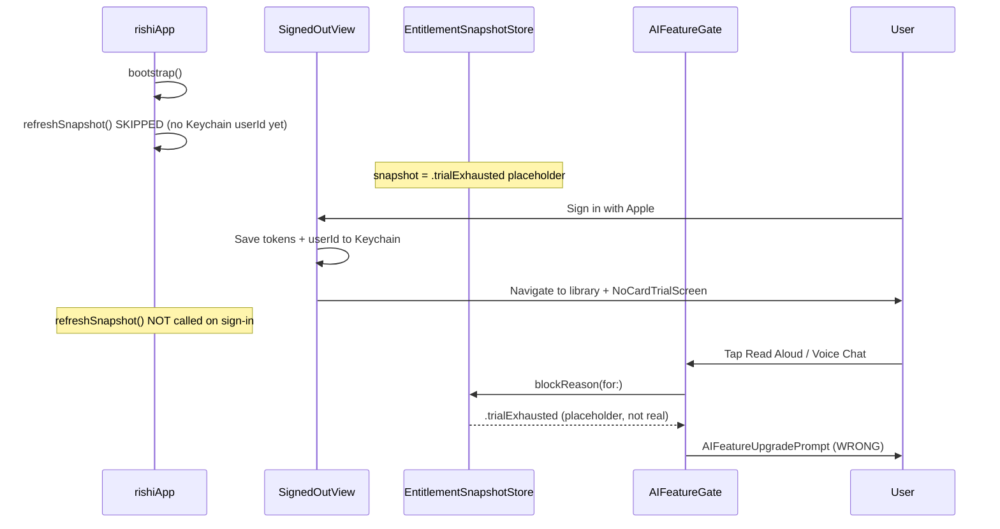

# Entitlement prefetch and false-exhaustion fix

> **Status:** Adversarial review loop complete — **PASS** (6 rounds, 0 open issues). Process: [`docs/superpowers/ADVERSARIAL-REVIEW-LOOP.md`](../../../../../docs/superpowers/ADVERSARIAL-REVIEW-LOOP.md)
>
> **Goal:** Ensure no user ever sees "You're out of trial credits" until `/api/billing/me` has returned a real `trial_exhausted` (or `trial_active` with 0 credits). Fix fresh-install and cross-device sign-in races by prefetching entitlement at auth boundaries and distinguishing **unresolved** from **resolved** snapshot state.

---

## Problem confirmed

Production account had **487 trial credits** (`GET /api/billing/me` → `trial_active`), but the app showed **"You're out of trial credits"** on a fresh install after sign-in and the no-card trial intro (`NoCardTrialScreen`).

This is a **client-side race**, not a server billing bug.



### Root causes

1. **Missing post-auth fetch** — [`rishiApp.swift`](../../rishi/rishi/rishiApp.swift) only refreshes at launch/foreground when Keychain already has `userId`. Fresh install skips launch refresh. [`SignedOutView.swift`](../../rishi/rishi/Auth/SignedOutView.swift) never refreshes after sign-in.

2. **Placeholder indistinguishable from real exhaustion** — [`EntitlementService`](../../Packages/RishiBilling/Sources/RishiBilling/Service/EntitlementService.swift) / [`EntitlementSnapshotStore`](../../Packages/RishiBilling/Sources/RishiBilling/Entitlements/EntitlementSnapshotStore.swift) init to `.trialExhausted`. [`blockReason(for:)`](../../Packages/RishiBilling/Sources/RishiBilling/Entitlements/AIFeatureGate.swift) treats that as real.

3. **Downstream consumers inherit the lie** — [`EntitlementClientState.derived(from:)`](../../Packages/RishiBilling/Sources/RishiBilling/Entitlements/EntitlementClientState.swift), [`RemainingAllowanceView`](../../Packages/RishiBilling/Sources/RishiBilling/UI/RemainingAllowanceView.swift).

---

## Adversarial review loop

Each round: **review plan → log findings → update plan → re-review**.

### Round 1 — Review

| # | Sev | Finding | Resolution |
|---|-----|---------|------------|
| 1 | Critical | `EntitlementSnapshot` is Decodable-only; persistence unimplementable | Add Encodable (Task 1) |
| 2 | Critical | Six `.snapshot` call sites; plan only named two gates | Consumer audit table |
| 3 | Critical | `ReaderVoiceEntry.presentVoice()` is sync | Async Task gate + loading state |
| 4 | Critical | Sign-out fragmented; snapshot never cleared | Unified chokepoint (Task 5) |
| 5 | High | Duplicate refresh hooks without coalescing | `EntitlementRefreshCoordinator` |
| 6 | High | Cache hydrate timing unspecified (no userId at actor init) | `bindToUser(userId:)` |
| 7 | High | Stale cached exhaustion could block | *Incomplete — see Round 4* |
| 8 | Medium | NoCardTrialScreen before fetch | Await refresh before present |
| 9 | Medium | Fail-closed → fail-open tradeoff undocumented | Document + server backstop |
| 10 | Low | Plan outside repo convention | Moved to `apps/apple/docs/superpowers/plans/` |

**Round 1 result:** 9 fixes applied. Issue #7 not fully resolved. **Re-review required.**

---

### Round 2 — Re-review

| # | Sev | Finding | Resolution |
|---|-----|---------|------------|
| 11 | High | `AsyncStream<EntitlementSnapshot>` must become resolution stream | Stream `EntitlementSnapshotResolution`; rewrite store pump |
| 12 | Medium | `LibraryTabView.onChange(of: snapshot)` breaks if optional | Observe `resolution` |
| 13 | Medium | Mac vs iOS sign-out inconsistent | Single chokepoint wires both |
| 14 | Low | `snapshotNow()` ambiguous | Rename to `resolutionNow()` |

**Round 2 result:** 4 fixes applied. **Re-review required.**

---

### Round 3 — Re-review

| # | Sev | Finding | Resolution |
|---|-----|---------|------------|
| — | — | Fail-open while unresolved acceptable if server enforces | Documented as accepted tradeoff |
| — | — | Stale Settings display acceptable with background refresh | Documented as accepted tradeoff |

**Round 3 result:** PASS WITH NOTES — but issue #7 (stale **resolved** exhaustion blocking) still latent. **Re-review required** (user requested loop until zero issues).

---

### Round 4 — Re-review (latent issue hunt)

| # | Sev | Finding | Resolution |
|---|-----|---------|------------|
| 15 | Critical | Hydrating cache as `.resolved(.trialExhausted)` still blocks via `blockReason` — Round 1 #7 fix was wrong | Add `fetchedAt` to resolution; **revalidate before any exhaustion prompt** (see §2.1) |
| 16 | High | `CurrentViewModifier`, `EntitlementSyncHooks.onSynced`, `LibraryTabView` paywall dismiss bypass coordinator | All refresh paths route through coordinator (§3) |
| 17 | High | `BillingSection` renders nothing when `entitlementSnapshot == nil` — not a loading state | Pass `resolution` into Settings; show "Checking allowance…" (§6) |
| 18 | High | `AppDependencies.performSignOut()` cannot call `currentUserBox` — not owned there | Split: `clearEntitlementState(for:)` on deps; hosts call `currentUserBox.signout()` (§5) |
| 19 | Medium | `bindToUser` not called at end of `ServiceGraphFactory.build` when `userIdBox` already set | Call `bindToUser` + coordinator refresh at bootstrap if Keychain userId present (§3) |
| 20 | Medium | `ReaderVoiceEntry` uses `refreshCoordinator` but injection not in task list | Add coordinator to `ReaderVoiceEntry` init (Task 4) |
| 21 | Low | Coordinator coalescing test listed under RishiBilling but coordinator placement undecided | Place coordinator in **RishiBilling** (§3) |

**Round 4 result:** 7 fixes applied. **Re-review required.**

---

### Round 5 — Re-review

| # | Sev | Finding | Resolution |
|---|-----|---------|------------|
| 22 | Medium | `EntitlementSnapshotResolution` package placement unspecified | Define in **RishiBilling** (alongside store/service); RishiCore keeps wire enum only |
| 23 | Medium | `SettingsContent` passes snapshot once at body eval — won't live-update | Use `@Environment(EntitlementSnapshotStore.self)` in SettingsContent or pass store reference |
| 24 | Low | Task order implicit | Add explicit dependency chain (§Implementation order) |

**Round 5 result:** 3 fixes applied. **Re-review required.**

---

### Round 6 — Re-review

No new critical, high, or medium findings. All Round 1–5 resolutions verified against codebase call sites.

**Round 6 result: PASS — 0 open issues. Plan ready to execute.**

---

## Design

### 1. Resolution state

Define in **RishiBilling** (`Entitlements/EntitlementSnapshotResolution.swift`):

```swift
public enum EntitlementSnapshotResolution: Sendable, Equatable {
    case unresolved
    case resolved(EntitlementSnapshot, fetchedAt: Date)
}
```

**Rules:**
- Initial: `.unresolved`
- Successful `refreshSnapshot()` → `.resolved(snapshot, fetchedAt: .now)`
- Sign-out / userId change → `.unresolved` + delete persisted cache for outgoing user
- Fetch failure while unresolved → stay `.unresolved`
- Fetch failure while resolved → keep last resolved (existing contract)
- Cache hydrate via `bindToUser` → `.resolved(cached, fetchedAt: cacheWrittenAt)`

**Store API:**

| Old | New |
|-----|-----|
| `store.snapshot` | `store.resolution` |
| `store.snapshot.blockReason(...)` | `store.blockReason(for:)` |
| — | `store.isResolved: Bool` |
| — | `store.resolvedSnapshot: EntitlementSnapshot?` |

`EntitlementClientState.derived(from:)` runs only when `.resolved` — empty set when `.unresolved`.

`EntitlementService` streams `EntitlementSnapshotResolution` (not raw snapshot). Rename `snapshotNow()` → `resolutionNow()`.

### 2. AI gating (no false exhaustion)

```swift
// EntitlementSnapshotStore
public func blockReason(for feature: AIFeature) -> AIFeatureBlockReason? {
    guard case .resolved(let snapshot, _) = resolution else { return nil }
    return snapshot.blockReason(for: feature)
}
```

#### 2.1 Revalidate before exhaustion prompt (fixes Round 4 #15)

Exhaustion prompts are high-stakes. **Always refresh before showing one:**

```swift
func gateAIFeature(_ feature: AIFeature) async -> AIFeatureBlockReason? {
    if needsRefreshBeforeGate {
        await coordinator.refreshIfSignedIn(reason: .aiFeatureTap)
    }
    return store.blockReason(for: feature)
}

var needsRefreshBeforeGate: Bool {
    switch store.resolution {
    case .unresolved: return true
    case .resolved(_, let fetchedAt):
        return Date.now.timeIntervalSince(fetchedAt) > 30 // match server Cache-Control
    }
}
```

If refresh succeeds and snapshot is `.trialActive`, proceed. If `.trialExhausted` **after fresh fetch**, show prompt. Never show exhaustion prompt on placeholder or stale cache alone.

**Fail-open while unresolved:** taps proceed to refresh path (loading UI), not upgrade prompt. Server enforces on TTS/voice endpoints.

### 3. EntitlementRefreshCoordinator

Place in **RishiBilling** (`Service/EntitlementRefreshCoordinator.swift`) beside `EntitlementService` — testable in package, injectable from app.

```swift
@MainActor
public final class EntitlementRefreshCoordinator {
    private var inFlight: Task<Void, Never>?
    private let entitlementService: EntitlementService
    private let restoreService: RestoreService // inject protocol if needed

    public func refreshIfSignedIn(reason: RefreshReason) async {
        guard (try? Keychain.load(.userId)) != nil else { return }
        if let existing = inFlight { await existing.value; return }
        let task = Task {
            await entitlementService.refreshSnapshot()
            await restoreService.refreshOnDeviceEntitlementAtLaunch()
        }
        inFlight = task
        await task.value
        inFlight = nil
    }
}
```

**All refresh call sites must use coordinator** (Round 4 #16):

| Trigger | File |
|---------|------|
| Cold launch | `rishiApp.swift` |
| Foreground | `rishiApp.swift` |
| Sign-in | `SignedOutView.swift` |
| Keychain session restore | `RootView.swift` bootstrap `.task` |
| Bootstrap with existing userId | `ServiceGraphFactory.build` (end) |
| Entitlement-sync success | `EntitlementSyncHooks.onSynced` |
| StoreKit status change | `CurrentViewModifier.swift` |
| Paywall dismiss | `LibraryTabView.swift` |
| No-card trial intro | `presentNoCardTrialIntroIfNeeded` — await before sheet |
| AI feature tap | `ReaderDestination` / `ReaderVoiceEntry` via `gateAIFeature` |

No separate `.onChange(of: currentUserBox.state)` hook — covered by sign-in + restore + bootstrap paths.

### 4. Per-user persistence

- Key: `billing.entitlement.snapshot.v1.<userId>`
- Value: JSON blob + `cachedAt` timestamp (ISO8601 alongside wire snapshot)
- Add `Encodable` to [`EntitlementSnapshot`](../../Packages/RishiCore/Sources/RishiCore/Models/EntitlementSnapshot.swift) mirroring existing Decodable wire keys
- `bindToUser(userId:)` → load cache → emit `.resolved(cached, fetchedAt: cachedAt)` or `.unresolved`
- On refresh success → persist snapshot + `cachedAt = now`
- On sign-out / account switch → delete outgoing user's key

### 5. Sign-out chokepoint (Round 4 #18 fix)

`AppDependencies` does **not** own `CurrentUserBox`. Split responsibilities:

```swift
// AppDependencies — callable from any sign-out host
func clearEntitlementState(for userId: String?) async {
    await entitlementService.clearSnapshotCache(for: userId)
    await entitlementService.clearCache() // binary EntitlementLevel
    entitlementReconciler.reset()
}

// Each host (Settings, Mac menu, RootView env):
func signOut() async {
    let outgoing = try? Keychain.load(.userId)
    await deps.clearEntitlementState(for: outgoing)
    currentUserBox.signout()
    // try? await auth.signOut() — optional server revoke
}
```

Replace RootView's partial `\.signOut` env (reconciler-only) with full sequence above.

### 6. Display surfaces

| Surface | Unresolved | Resolved |
|---------|------------|----------|
| `RemainingAllowanceView` | New param `isLoading: true` → "Checking allowance…" | Existing switch on snapshot |
| `BillingSection` | Show loading row when `resolution == .unresolved` | Pass resolved snapshot |
| `SettingsContent` | `@Environment(EntitlementSnapshotStore.self)` for live updates (Round 5 #23) | — |
| `NoCardTrialScreen` | Await coordinator refresh before present; show live credits if `.trialActive` | — |
| `LibraryTabView` / `SignedInView` `isPaidActive` | `false` when unresolved | From resolved snapshot |
| AI gates | Loading → refresh → gate (§2.1) | — |

### 7. ReaderVoiceEntry + ReaderDestination async gate

Inject `EntitlementRefreshCoordinator` into `ReaderVoiceEntry` init (production always passes it).

```swift
func presentVoice(...) {
    Task {
        isCheckingEntitlement = true
        defer { isCheckingEntitlement = false }
        if let reason = await gateAIFeature(.voiceChat) {
            pendingUpgradePrompt = reason
            return
        }
        await voicePresenter.start(...)
    }
}
```

Shared `gateAIFeature` helper (app target or RishiBilling extension on store+coordinator).

---

## Consumer audit

| File | Change |
|------|--------|
| [`ReaderDestination.swift`](../../rishi/rishi/Reader/ReaderDestination.swift) | `gateAIFeature(.narration)` |
| [`ReaderVoiceEntry.swift`](../../rishi/rishi/Voice/ReaderVoiceEntry.swift) | coordinator injection + `gateAIFeature(.voiceChat)` |
| [`SettingsContent.swift`](../../rishi/rishi/Settings/SettingsContent.swift) | `@Environment(EntitlementSnapshotStore.self)`; pass resolution to SettingsScreen |
| [`SettingsScreen.swift`](../../Packages/RishiSettings/Sources/RishiSettings/UI/SettingsScreen.swift) | Accept resolution or loading flag |
| [`BillingSection.swift`](../../Packages/RishiSettings/Sources/RishiSettings/UI/Billing/BillingSection.swift) | Loading branch when unresolved |
| [`RemainingAllowanceView.swift`](../../Packages/RishiBilling/Sources/RishiBilling/UI/RemainingAllowanceView.swift) | `isLoading` param |
| [`LibraryTabView.swift`](../../rishi/rishi/Library/LibraryTabView.swift) | nil-safe `isPaidActive`; observe `resolution` |
| [`SignedInView.swift`](../../rishi/rishi/Views/SignedInView.swift) | nil-safe `isPaidActive` |
| [`EntitlementSnapshotStore.swift`](../../Packages/RishiBilling/Sources/RishiBilling/Entitlements/EntitlementSnapshotStore.swift) | resolution-based |
| [`EntitlementClientState.swift`](../../Packages/RishiBilling/Sources/RishiBilling/Entitlements/EntitlementClientState.swift) | skip derive when unresolved |
| [`CurrentViewModifier.swift`](../../rishi/rishi/CurrentViewModifier.swift) | coordinator |
| [`ServiceGraphFactory.swift`](../../rishi/rishi/ServiceGraphFactory.swift) | coordinator wiring; bindToUser; onSynced → coordinator |
| [`rishiApp.swift`](../../rishi/rishi/rishiApp.swift) | coordinator |
| [`SignedOutView.swift`](../../rishi/rishi/Auth/SignedOutView.swift) | coordinator after sign-in |
| [`RootView.swift`](../../rishi/rishi/RootView.swift) | coordinator after session restore; full signOut |

---

## Implementation order

Tasks are sequential — do not start a task until its predecessor passes build:

1. **Task 1** — Resolution model, Encodable, EntitlementService persistence + `bindToUser` + resolution stream
2. **Task 2** — EntitlementSnapshotStore, `blockReason`, RemainingAllowanceView loading
3. **Task 3** — EntitlementRefreshCoordinator + migrate all refresh call sites
4. **Task 4** — `gateAIFeature` helper + ReaderDestination + ReaderVoiceEntry
5. **Task 5** — `clearEntitlementState` + wire all sign-out hosts
6. **Task 6** — Tests + xcodebuild gate

---

## Tests

**RishiBilling:**
1. `blockReason` while `.unresolved` → `nil`
2. Resolved `.trialActive(487)` → `nil`
3. Resolved `.trialExhausted` **after fresh fetch** → `.trialExhausted`
4. Stale resolved `.trialExhausted` (old `fetchedAt`) + tap gate → refresh called before prompt
5. `clearSnapshotCache` → `.unresolved`
6. `bindToUser` B after A → B's cache only
7. Encodable/Decodable round-trip
8. Coordinator coalesces parallel calls (single network hit)

**Manual matrix:**

| Scenario | Expected |
|----------|----------|
| Fresh install → sign up → NoCardTrialScreen → Read Aloud | Never false exhaustion |
| Cross-device sign-in with trial credits | Correct allowance; AI works |
| Actually exhausted (confirmed by fresh `/me`) | Prompt shown |
| Sign out → different user | No stale snapshot |
| Airplane mode at sign-in → AI tap | Loading; no exhaustion prompt; server error if still offline |
| Same device, stale cached exhaustion, server has credits | Tap triggers refresh; narration works |

Build gate: `swift test --package-path apps/apple/Packages/RishiBilling` + `xcodebuild` scheme `rishi`.

---

## Out of scope

- D1 mirror lag (server audit)
- Merging `EntitlementLevel` and `EntitlementSnapshot`
- Changing server trial grant amounts

---

## Todos

- [ ] Task 1: Resolution model, Encodable, EntitlementService persistence + bindToUser
- [ ] Task 2: EntitlementSnapshotStore, blockReason, RemainingAllowanceView loading
- [ ] Task 3: EntitlementRefreshCoordinator + all refresh call sites
- [ ] Task 4: gateAIFeature + ReaderDestination + ReaderVoiceEntry
- [ ] Task 5: clearEntitlementState + sign-out hosts
- [ ] Task 6: Tests + xcodebuild gate
