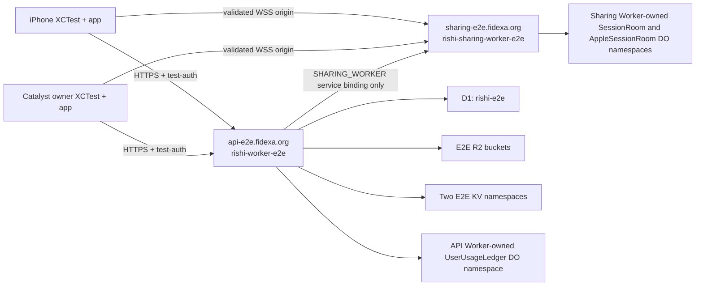

# Shared-Reading Live E2E Isolated Environment Remediation Design

> **Status:** Adversarial review loop active — four completed design rounds; independent implementation-plan remediations pending re-review.
>
> **Amends:** [2026-09-17 Shared-Reading Repeatable Local End-to-End Test Design](2026-09-17-shared-reading-live-e2e-test-design.md). This amendment supersedes that design's production-API assumption and its Worker-out-of-scope statement for the live shared-reading path only. It does not change ordinary application launches, Electron, MCP, or GitHub workflows.

## Goal

Run the existing Apple shared-reading live XCTest against a disposable, publicly reachable Cloudflare environment without enabling test authentication, creating test users, writing books, or opening a test WebSocket path on production.

The two live peers remain a Catalyst owner and an iPhone participant. They use two disposable E2E accounts, create one session, exchange real API and Durable Object traffic, and prove that the participant observes reading sequence `>= 2`. Every run uses the isolated API and sharing origins below.

## Binding decisions

| Concern | Decision |
| --- | --- |
| Public API endpoint | `https://api-e2e.fidexa.org` is a dedicated Cloudflare custom domain for the E2E API Worker. |
| Public sharing endpoint | `wss://sharing-e2e.fidexa.org` is a dedicated Cloudflare custom domain for the E2E sharing Worker. |
| Production test auth | Production keeps `ENABLE_TEST_AUTH` absent and disabled. No production secret, route, test account, or test bearer is used. |
| Scripts | Deploy distinct scripts named `rishi-worker-e2e` and `rishi-sharing-worker-e2e`, using explicit `env.e2e` configuration blocks. |
| API-to-sharing call | The only service binding is `SHARING_WORKER -> rishi-sharing-worker-e2e`. The API never calls production sharing, and the sharing Worker has no service binding. |
| State | D1, R2, KV, and Durable Object namespaces are E2E-owned and distinct from production. |
| Apple endpoint selection | Only a debug, real-auth E2E launch with all required gates may select the two E2E origins. Normal debug and release launches continue to select the bundle's production origins. |
| Returned WebSocket URL | The app rejects any server-returned `wsUrl` whose origin differs from the launch's configured sharing origin before opening a socket. |
| Recovery | Account recovery needs only `https://api-e2e.fidexa.org`; it never needs a sharing URL or a production endpoint. |

## Why an isolated deployment

Three options were considered.

| Option | Trade-off | Result |
| --- | --- | --- |
| Enable the existing test-auth gate on `api.fidexa.org` | Smallest deployment change, but exposes test-only account creation and deletion on the production data plane and makes a live-test cleanup error a production-data incident. | Rejected. |
| Reuse a general staging or preview environment | Less infrastructure to create, but shared data, routes, secrets, and concurrent users make repeated deletion and residue proof unreliable. | Rejected. |
| Dedicated API and sharing scripts with dedicated state | Requires deliberate provisioning and configuration verification, but gives fixed endpoints, repeatable cleanup, and a hard production boundary. | Accepted. |

The accepted design is intentionally more explicit than an inherited Wrangler environment. Wrangler environments do not safely inherit all binding classes. An implicit or partial environment can silently retain a production database, bucket, namespace, route, or service target; that is unacceptable for account-creating E2E traffic.

## Deployment topology and data flow



The owner and participant authenticate through `POST /test/sign-in` only on `api-e2e.fidexa.org`, upload/read their fixture through the E2E book bucket, and create/redeem the real session through the E2E API. The API signs its internal request with `SHARING_INTERNAL_SECRET`; the service binding delivers it to `rishi-sharing-worker-e2e`, which verifies the corresponding `WORKER_HMAC_SECRET`. The API response supplies a `wsUrl`; each app verifies that it belongs to `wss://sharing-e2e.fidexa.org` before connecting. The session's WebSocket and Durable Object traffic therefore never crosses into a production Worker namespace.

After both peer processes stop, the host calls an E2E-only, test-authenticated shared-reading cleanup operation with the two generated account addresses. The operation resolves only those generated E2E users and enumerates every owned reading-session row. For each existing room it fetches current status, requires the current `controllerUserId` to belong to one of those generated accounts, and ends a non-ended room as that current controller using the returned controller generation. On one stale-generation conflict it re-reads status and retries once under the same generated-controller constraint; any further conflict fails closed. It then verifies ended state, purges the E2E `AppleSessionRoom`, and independently verifies that the room is absent before account deletion begins. The same operation is run from crash recovery using the journaled addresses. It is idempotent when the users or rooms are already absent or a room is already ended.

## Cloudflare resources and explicit `env.e2e` contracts

### API Worker: `rishi-worker-e2e`

`workers/worker/wrangler.jsonc` must contain a complete `env.e2e` block. Its `name` is `rishi-worker-e2e`; its route is exactly `{ "pattern": "api-e2e.fidexa.org", "custom_domain": true }`. The block must explicitly redeclare every non-inheritable resource binding and variable used by this Worker. The deployment command uses `--env e2e`, never the default or production environment.

| Binding or configuration | E2E value and rule |
| --- | --- |
| `SHARING_WORKER` service binding | `service: "rishi-sharing-worker-e2e"`; this is the sole service binding. |
| `DB` D1 binding | A newly provisioned database named `rishi-e2e`, with its Cloudflare-assigned E2E database ID and the repository's existing Drizzle migration directory and migration pattern. It must not equal the production `rishi` database ID. |
| `APPLE` R2 binding | `bucket_name: "apple-e2e"`. |
| `BOOK_STORAGE` R2 binding | `bucket_name: "rishi-books-e2e"`. |
| `TTS_CACHE` R2 binding | `bucket_name: "rishi-tts-cache-e2e"`. |
| `apple_dev` R2 binding | `bucket_name: "apple-dev-e2e"`. |
| `RISHI_DESKTOP_STATE` KV binding | First newly provisioned E2E KV namespace, with its E2E namespace ID. The remote-only E2E environment declares no preview ID. |
| `RATE_LIMIT_KV` KV binding | Second newly provisioned E2E KV namespace, with a different E2E namespace ID. The remote-only E2E environment declares no preview ID. |
| `USER_USAGE_LEDGER` DO binding and migrations | Explicitly bind `UserUsageLedger` and explicitly redeclare its SQLite migration. Because it belongs to `rishi-worker-e2e`, its Durable Object namespace is owned by that script and cannot be a production namespace. |
| `CF_VERSION_METADATA` and SQL text rule | Preserve the current version metadata binding and SQL text bundling rule so the deployed E2E script has the same executable/migration shape. |
| Compatibility settings | Explicitly retain the current compatibility date and `nodejs_als`/`nodejs_compat` flags. |
| Cron triggers | Declare no E2E cron triggers. The live test does not need scheduled work, and it must not inherit production schedules. |

The E2E API vars are explicit rather than inherited:

```jsonc
{
  "PUBLIC_API_URL": "https://api-e2e.fidexa.org",
  "PUBLIC_WEB_URL": "https://api-e2e.fidexa.org",
  "SHARING_WORKER_WS_URL": "wss://sharing-e2e.fidexa.org",
  "ENABLE_TEST_AUTH": "true",
  "CLOUDFLARE_ACCOUNT_ID": "b700cf80e995aacbfa27aaa8d2084d18",
  "BOOK_STORAGE_BUCKET_NAME": "rishi-books-e2e",
  "BOOK_MAX_FILE_BYTES": "838860800",
  "BOOK_MAX_PER_USER": "500",
  "BOOK_MAX_USER_BYTES": "10737418240"
}
```

`PUBLIC_WEB_URL` is deliberately an E2E origin even though browser-based web authentication is outside this test. This prevents the E2E script from producing a production web redirect if a non-exercised route is accidentally reached. No E2E test flow needs an additional web custom domain.

The production/default configuration retains `PUBLIC_API_URL=https://api.fidexa.org`, `PUBLIC_WEB_URL=https://rishi.fidexa.org`, `SHARING_WORKER_WS_URL=wss://sharing.fidexa.org`, `BOOK_STORAGE_BUCKET_NAME=rishi-books` matching its production `BOOK_STORAGE` binding, no `ENABLE_TEST_AUTH`, and no E2E route or resource ID.

### Sharing Worker: `rishi-sharing-worker-e2e`

`workers/sharing-worker/wrangler.jsonc` must contain an equally complete `env.e2e` block. Its `name` is `rishi-sharing-worker-e2e`; its route is exactly `{ "pattern": "sharing-e2e.fidexa.org", "custom_domain": true }`; and its `AUTH_BASE_URL` is exactly `https://api-e2e.fidexa.org`.

The block explicitly redeclares both Durable Object bindings, their existing SQLite migrations, `nodejs_compat`, observability settings, and the following vars:

```jsonc
{
  "AUTH_BASE_URL": "https://api-e2e.fidexa.org",
  "TEST_AUTH_ALLOWED": "1"
}
```

`TEST_AUTH_ALLOWED=1` exists only in the E2E sharing environment. Production keeps the variable absent, so the `userId--DisplayName` test bearer and the relay-only test path remain rejected. The E2E `SESSION_ROOM` and `APPLE_SESSION_ROOM` namespaces are owned by `rishi-sharing-worker-e2e`; production retains ownership of its own namespaces. No DO binding is shared between these two scripts, and the E2E sharing Worker has no service bindings.

## R2 presigning remediation

`workers/worker/src/r2-presign.ts` currently hard-codes `rishi-books`. That makes a correctly isolated `BOOK_STORAGE` binding insufficient: a presigned URL would still name the production bucket. This is a correctness and isolation defect.

Replace the constant with the required `R2SigningEnv.BOOK_STORAGE_BUCKET_NAME` value. Production configuration sets it to `rishi-books`; `env.e2e` sets it to `rishi-books-e2e`. The signer must form its path from that value, and its unit tests must prove both the production and E2E bucket paths. The R2 credentials used by the E2E worker must use Cloudflare's bucket-scoped Object Read & Write permission on `rishi-books-e2e` only. Cloudflare defines that permission as read, write, and list objects in the selected bucket, so object listing is an unavoidable capability; the credential must not grant bucket administration, account-wide access, or access to any other bucket. Provisioning these credentials is a secure Cloudflare secret-management operation, not a checked-in value.

## Environment-specific share links

`workers/worker/src/routes/session-shares.ts` currently hard-codes `https://rishi.fidexa.org` in both new and idempotently returned share links. Replace that literal with the required, validated `PUBLIC_WEB_URL` environment origin. Production keeps `PUBLIC_WEB_URL=https://rishi.fidexa.org`; E2E uses exactly `PUBLIC_WEB_URL=https://api-e2e.fidexa.org`, so an E2E response cannot direct a test client to the production web origin. The value must be an HTTPS origin with no user info, alternate port, path, query, or fragment. Route tests must cover production preservation, the E2E origin, and malformed-value rejection. The Apple E2E harness must accept only the exact E2E share-link origin during a gated run and continue to extract only the raw invite token for relay to the participant.

## Minimum secret model

Secrets are set directly on the E2E script/environment through the deployment operator's secret store. Values are never placed in `wrangler.jsonc`, cloned from production, logged, persisted in the recovery journal, or passed in an unredacted result bundle.

| Secret | E2E ownership and use |
| --- | --- |
| `TEST_AUTH_SECRET` | Independently generated for `rishi-worker-e2e`; protects E2E-only account provisioning, sign-in, deletion, and recovery. |
| `BETTER_AUTH_SECRET` | Independently generated for `rishi-worker-e2e`; signs E2E app authentication/session state and share-token behavior. |
| `SHARING_INTERNAL_SECRET` | One independently generated E2E value on `rishi-worker-e2e`; signs API-to-sharing internal actions. |
| `WORKER_HMAC_SECRET` | The exact same E2E value as `SHARING_INTERNAL_SECRET`, installed on `rishi-sharing-worker-e2e`; verifies those internal actions and signs E2E room tokens. |
| `ACCESS_TOKEN_SECRET` | Independently generated for `rishi-worker-e2e`; required by the exercised auth flow. |
| `REFRESH_TOKEN_SECRET` | Independently generated for `rishi-worker-e2e`; required by the exercised auth flow. |
| `VOICE_SESSION_NONCE_SECRET` | Independently generated for `rishi-worker-e2e`; required by the exercised Worker/ledger flow. |
| `R2_ACCESS_KEY_ID`, `R2_SECRET_ACCESS_KEY` | A separately provisioned E2E credential pair with Cloudflare's bucket-scoped Object Read and Write permission on `rishi-books-e2e`, installed only on `rishi-worker-e2e`. It has no access to another bucket or account-level administration. |

`CLOUDFLARE_ACCOUNT_ID=b700cf80e995aacbfa27aaa8d2084d18` is a required non-secret E2E variable because every presigned fixture upload and download uses it to construct the R2 hostname. It does not grant access by itself. The config-isolation verifier must require that exact account ID together with the E2E bucket name, and deployment smoke must complete a signed PUT and GET against `rishi-books-e2e`. The E2E environment must not copy Apple Sign in, APNs, Resend, Stripe, Google, OpenAI, Deepgram, ElevenLabs, Upstash, or other external email, payment, or AI secrets merely to satisfy the production `secrets.required` declaration. The E2E config's required-secret validation lists only the secret set above. Routes requiring omitted capabilities fail closed or remain unexercised.

TURN is optional. Do not provision `TURN_KEY_ID` or `TURN_API_TOKEN` initially. The live flow uses the existing STUN fallback. Add E2E-only TURN secrets only after a recorded live run proves that STUN cannot establish the required peer path; production TURN credentials are never copied.

## Apple launch injection and endpoint validation

Define the following two E2E endpoint variables:

```text
RISHI_E2E_API_BASE_URL=https://api-e2e.fidexa.org
RISHI_E2E_SHARING_WS_URL=wss://sharing-e2e.fidexa.org
```

For both owner and participant generated `.xctestrun` files, inject these exact values into all of `EnvironmentVariables`, `TestingEnvironmentVariables`, and `UITargetAppEnvironmentVariables`. The host must inject them into both XCTest runners and both launched application processes; it must not rely on parent-process inheritance. The existing E2E credentials, rendezvous configuration, registration nonces, and per-run artifact protections retain their current handling.

`RishiAPIEnvironment` gains an E2E mode only when all of these are true: the binary is a Debug build, `RISHI_UITEST=1`, `RISHI_E2E_REAL_AUTH=1`, and both endpoint variables equal the exact HTTPS/WSS E2E origins above with no query, fragment, user info, alternate port, or path. Once both E2E gates are present, any missing, malformed, or mixed origin fails closed and the test app does not boot into a production fallback. Release builds and normal debug app launches ignore the two E2E variables and retain their production `RishiAPIBaseURL` and `RishiSharingWebSocketURL` values.

When a session create or redeem response returns `wsUrl`, `SharedReadingSignalingClient` must parse it before opening `URLSessionWebSocketTask`. It accepts the URL only when its scheme is `wss`, its normalized origin exactly equals the active environment's `sharingWebSocketURL` origin, and it contains no user info, query, or fragment. A session-specific path remains permitted. On rejection, it emits the existing typed signaling/API failure and opens no socket. This closes the server-response redirection path even if an API response is malformed or compromised.

## Recovery, failure handling, and rollback

`SharedReadingCLI`, `SharedReadingLiveRun`, preflight, and recovery currently require the production API origin. They must instead accept only the canonical `https://api-e2e.fidexa.org` E2E API origin for a live E2E run or `--cleanup-manifest` recovery. Recovery requires the existing network acknowledgement, E2E `TEST_AUTH_SECRET`, test domain, and recovery artifact; it makes account-deletion and absence-verification requests only to `api-e2e.fidexa.org`. It does not need `wss://sharing-e2e.fidexa.org` because it recovers API-owned accounts and local resources, not a new room connection.

The E2E API adds one gated remote-cleanup contract under the existing `ENABLE_TEST_AUTH=true` plus constant-time `X-Test-Auth-Secret` guard. Its request contains only the two generated `rishi-e2e-*` addresses already present in the recovery journal. It rejects any address outside the configured generated-account namespace and enumerates each owned session ID from D1. For every room that still exists, it obtains the current status, controller ID, and controller generation; requires that controller to resolve to one of the request's generated accounts; invokes the HMAC-protected `endRoom` action as that current controller when status is not already ended; and permits one status-refresh retry after `STALE_CONTROLLER_GENERATION`. It then confirms ended state, invokes `purgeAppleRoom`, and verifies a subsequent status lookup reports authoritative absence. An unknown controller, second conflict, or unverified room retains the recovery artifact and blocks account deletion; an already absent room is a successful idempotent result.

The existing gated `DELETE /test/users/:email` recovery route must delegate to the canonical fail-closed `deleteAccount` workflow rather than its current best-effort raw-table cleanup. It may first invoke the same room cleanup for that generated address. R2 deletion or absence-verification failure must therefore keep the account/deletion marker recoverable instead of deleting the D1 rows that identify stranded keys. The normal authenticated `/api/user` path remains the primary deletion path; the gated route is the bearer-independent recovery path.

Failures are handled as follows:

| Failure | Required behavior |
| --- | --- |
| Config names a production route, ID, bucket, KV namespace, service, or origin | Config-isolation verifier fails before deployment or a live run. |
| E2E API cannot call E2E sharing | Deployment smoke fails; no live accounts are created. |
| Test auth is unavailable on E2E | Preflight fails closed; recovery artifacts remain available. |
| Returned `wsUrl` is cross-origin or malformed | Client fails before socket creation; test records the typed failure and cleanup runs. |
| A remote room cannot be purged and verified absent | Account deletion does not begin; the journal is retained for recovery. |
| R2 deletion or absence verification fails | Canonical deletion fails closed and retains the account/deletion marker and recovery journal. |
| E2E account or process cleanup cannot be proven | The run fails, retains redacted recovery state, and blocks the next run until recovery succeeds. |
| Deployment rollback is needed | Disable/remove only E2E custom-domain routes and roll back only E2E scripts. Keep E2E D1, buckets, KV, DO state, and secrets until all retained journals recover their owned resources; then revoke E2E credentials and remove E2E resources. Production scripts, domains, state, and secrets are never rollback targets. |

## Deployment order

1. Provision `rishi-e2e`, four named R2 buckets, and two fresh KV namespaces; record their E2E-only Cloudflare IDs in the explicit E2E configuration.
2. Create the two custom domains and verify each points only to its corresponding E2E script.
3. Generate and install the minimum E2E secret set, including the one shared internal/HMAC value and bucket-scoped R2 credentials.
4. Implement the explicit `env.e2e` blocks, production-preserving presign bucket variable, config-isolation verifier, and deterministic tests.
5. Deploy `rishi-sharing-worker-e2e` first, including its E2E-owned Durable Object migrations and `AUTH_BASE_URL`/`TEST_AUTH_ALLOWED` vars.
6. Deploy `rishi-worker-e2e` second, including the service binding to `rishi-sharing-worker-e2e`, D1 migrations, E2E resources, and `ENABLE_TEST_AUTH=true`.
7. Run E2E deployment smoke and production-negative gates before allowing Apple live runs.
8. Implement the gated Apple endpoint injection, recovery-origin change, and returned-`wsUrl` validation; run deterministic tests.
9. Run the live scenario twice consecutively and retain the prescribed evidence.

No Electron, MCP, or GitHub workflow change is part of this sequence. The live command stays a locally invoked, explicitly acknowledged operation.

## Required evidence and completion gates

Completion requires all of the following fresh evidence, with secrets redacted:

1. Deterministic Swift and Worker tests pass. They cover gated E2E endpoint selection, ordinary Debug and Release-build production preservation, executable owner/participant/restart launch-environment injection with fail-before-launch behavior, recovery acceptance of only `https://api-e2e.fidexa.org`, returned-`wsUrl` origin rejection at the API and signaling-client socket boundary without creating a task, E2E presigned bucket paths, production bucket preservation, E2E share-link origin selection, and production share-link preservation.
2. A config-isolation verifier parses both explicit E2E configs and proves the exact script names, custom domains, every required API/sharing origin variable, `ENABLE_TEST_AUTH=true`, `TEST_AUTH_ALLOWED=1`, exact API service target, no sharing service bindings, D1 name/ID inequality, four R2 names, two KV IDs distinct from production and from each other, E2E DO ownership/migrations, empty E2E cron set, exact required `CLOUDFLARE_ACCOUNT_ID`, compatibility settings, API version metadata and SQL bundling rule, sharing observability, and absence of production resource identifiers. It also proves each environment's `BOOK_STORAGE_BUCKET_NAME` exactly equals that environment's `BOOK_STORAGE.bucket_name`, and production has no `ENABLE_TEST_AUTH` or `TEST_AUTH_ALLOWED` variable. Dry-run deployment inspection independently confirms Wrangler resolves only those E2E targets.
3. Deployment smoke requires exact health contracts: API returns `200`, JSON content type, `status="healthy"`, `service="openai-tts-proxy"`, a parseable timestamp, `X-Rishi-API-Version: v1`, `X-Rishi-Worker-Name: rishi-worker`, and a non-empty deployed `X-Rishi-Worker-Version`; sharing returns `200`, `text/plain` content type, and exact body `ok`. It then creates two E2E accounts, obtains a signed fixture PUT, uploads bytes to `rishi-books-e2e`, registers the owner book through authenticated metadata sync/push, verifies a signed GET, creates a real session, redeems it as the participant, and proves the room exists. Gated cleanup receives both generated addresses, authoritatively purges the room, and canonical deletion independently proves both accounts and both account object prefixes absent. The share URL uses the exact E2E origin.
4. The production negative gate proves `https://api.fidexa.org/test/sign-in` returns `404` without presenting an E2E secret, and proves the production sharing Worker rejects a synthetic `userId--DisplayName` test bearer. This evidence confirms that production test-auth and sharing test-bearer shortcuts remain disabled.
5. Two consecutive focused Apple live runs use the exact E2E API and WSS origins. Each result identifies its unique run ID, has participant-observed sequence `>= 2`, records exactly two generated disposable accounts, and records two independently verified deleted accounts.
6. Each completed run proves no residue: no retained recovery journal/manifest/secret `.xctestrun` clone/staged fixture/local owned process, no account rows for either recorded address, no E2E R2 object under either generated account prefix, and no active or unpurged E2E shared-reading room owned by either account. The E2E remote-cleanup operation verifies every enumerated room absent before account deletion, and canonical account deletion verifies R2/account absence; cleanup failure is a failed run, not a note.

## Scope boundary

This amendment changes only the infrastructure and client safety boundary required for Apple shared-reading live E2E. It does not authorize production test authentication, production data migration, a staging environment, Electron work, MCP work, GitHub workflow automation, or copying unrelated external-provider secrets.

## Adversarial review loop

Each round reviewed the amendment against the existing live-host implementation, both Wrangler configurations, the R2 signer, Apple endpoint selection, and the repository review rubric.

### Round 1 — Review

| # | Sev | Finding | Resolution |
| --- | --- | --- | --- |
| 1 | High | The existing live host and recovery accept only `api.fidexa.org`, so merely deploying E2E Workers would still direct live account traffic to production. | Required the exact `api-e2e.fidexa.org` allowlist for live preflight and recovery, and made recovery API-only. |
| 2 | High | `r2-presign.ts` hard-codes `rishi-books`; an E2E `BOOK_STORAGE` binding alone would still produce production-bucket presigned URLs. | Required `BOOK_STORAGE_BUCKET_NAME`, explicit production/E2E values, bucket-path tests, and bucket-scoped credentials. |
| 3 | High | Wrangler environment bindings can retain production targets when only vars are overridden. | Required complete `env.e2e` declarations, explicit resource map, a sole E2E service binding, and a resolved-config isolation verifier. |
| 4 | High | The app currently trusts server-returned `wsUrl` and has no gated E2E endpoint mode. | Required Debug/UI-test/real-auth-only origin injection plus exact returned-origin validation before socket creation. |
| 5 | Medium | Reusing production's required-secret list would invite copying unrelated sensitive provider credentials. | Defined the minimum per-flow secret model and explicit omission of external email, payment, and AI secrets. |

**Round 1 result:** Re-review required. All Critical/High resolutions were added to this amendment before the next review.

### Round 2 — Re-review

| # | Sev | Finding | Resolution |
| --- | --- | --- | --- |
| 1 | Medium | A sharing custom domain alone did not prove that API internal calls avoid production. | The final contract names `SHARING_WORKER -> rishi-sharing-worker-e2e` as the only service binding and requires verifier evidence of that exact target. |
| 2 | Medium | Cleanup evidence could have proved only local artifact removal while remote session state remained. | Completion now requires ended-and-purged E2E rooms, absent recorded accounts, empty run prefixes, and two verified deletions per run. |
| 3 | Low | `PUBLIC_WEB_URL` could accidentally preserve a production redirect in an unexercised route. | It is explicitly set to the E2E API origin, preventing an E2E Worker from emitting a production web origin. |

### Round 3 — Re-review

| # | Sev | Finding | Resolution |
| --- | --- | --- | --- |
| 1 | Medium | The completion gate required immediate room/R2 absence, but the existing public end route only schedules room deletion and the gated fallback account route swallowed R2 failures before deleting identifying rows. | Added an idempotent E2E-only cleanup-and-verification operation used by normal teardown and recovery before account deletion, and required the gated bearer-independent deletion route to delegate to canonical fail-closed account deletion. |

**Round 3 result:** Re-review required. The cleanup and deletion remediations were added before Round 4.

### Round 4 — Re-review

| # | Sev | Finding | Resolution |
| --- | --- | --- | --- |
| 1 | High | `purgeAppleRoom` rejects an active room, while normal live teardown can begin before the room is ended. | Required cleanup to fetch current status/controller generation, end as the recorded owner, verify ended state, then purge and verify authoritative absence; already-ended and already-absent rooms remain idempotent successes. |

**Round 4 result:** **PASS** — 0 open Critical, High, or Medium issues.

### Round 5 — Independent implementation-plan review

| # | Sev | Finding | Resolution |
| --- | --- | --- | --- |
| 1 | High | The plan could pass smoke without creating a room, could mismatch the presign bucket variable and binding, and omitted the real recovery-journal deletion boundary. | Required a real created-and-purged room, exact variable/binding equality, and cleanup-before-delete tests at `SharedReadingRecoveryJournal`. |
| 2 | High | API-only WebSocket validation did not satisfy the before-socket invariant. | Required independent validation immediately before every initial/reconnect task creation and a test factory proving no task is created on rejection. |
| 3 | Medium | R2 permission wording prohibited list access even though Cloudflare's bucket-scoped Object Read & Write permission includes object listing. | Allowed listing only within `rishi-books-e2e`, while prohibiting bucket administration, account-wide access, and every other bucket. |
| 4 | Medium | A hard-coded production share-link origin and optional account ID could redirect E2E responses or break presigning. | Required environment-specific validated share links, exact account ID configuration, verifier coverage, and signed PUT/GET smoke. |
| 5 | Medium | Launch/release/service-binding/evidence-retention gates were incomplete. | Required executable launch and Release tests, no sharing service bindings, and retention of redacted evidence through final comparison. |

**Round 5 result:** remediations applied; independent re-review required before implementation.

### Round 6 — Independent plan re-review

| # | Sev | Finding | Resolution |
| --- | --- | --- | --- |
| 1 | High | Smoke uploaded bytes but omitted the metadata sync needed to create a book row, and used only one account despite the two-address cleanup contract. | Required the proven upload/PUT/sync-push sequence, two accounts, participant redemption, and independent cleanup/deletion checks for both. |
| 2 | Medium | Cleanup incorrectly assumed the recorded owner remained controller. | Required current-controller identity/generation from room status, generated-account membership, and one bounded stale-generation refresh/retry. |
| 3 | Medium | Verifier fixtures and health smoke left required configuration and response contracts ambiguous. | Enumerated every non-inherited config family, added dry-run inspection, and defined exact API and sharing health assertions. |

**Round 6 result:** remediations applied; independent re-review required before implementation.
