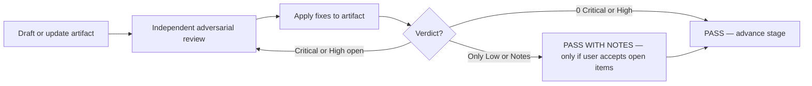

# Independent adversarial review loop

Canonical process for agents reviewing research, plans, and implementation in this repo.

**Related:** [`AGENTS.md`](../../AGENTS.md), [`CLAUDE.md`](../../CLAUDE.md) (summarize this doc), plan location rules in those files.

---

## Purpose

Catch wrong assumptions, incomplete call-site audits, and “looks fixed on paper” resolutions **before** implementation starts (or before a task is marked done). The reviewer’s job is to break the plan — not to confirm it.

---

## When it is required

Run an adversarial review loop at **each** stage:

| Stage | Artifact | Gate before |
|-------|----------|-------------|
| Research | Findings / summary | Writing or updating a plan |
| Plan | Plan markdown under `docs/superpowers/plans/` (Apple: `apps/apple/docs/superpowers/plans/`) | Task 1 / implementation |
| Implement | Code diff for the completed task or stage | Next task, or handoff |

**Exceptions:** pure doc typos, single-line comment fixes, or the user explicitly waives review for a trivial change.

---

## The loop (not a single pass)

A review loop is **iterative**. One pass that lists “Round 1 / 2 / 3 findings” in a single write **does not** satisfy the loop unless each round’s fixes were applied and **re-reviewed** separately.



### One round = four steps

1. **Review** — Read the current artifact cold. Search the codebase for call sites, ordering, and ownership the plan assumes. Try to disprove each claim.
2. **Log findings** — Numbered table: severity, finding, resolution (or “open”).
3. **Update artifact** — Edit the plan/findings/code spec so every Critical/High item has a concrete fix (file, API, rule, test).
4. **Re-review** — New pass over the **updated** artifact. Prior rounds’ fixes are inputs; hunt for regressions, new gaps, and “fixed on paper” items that still fail in code.

Repeat until **PASS** (see verdicts below).

---

## Independence

Each round should behave like a **different reviewer**:

- Do not assume earlier rounds caught everything.
- Re-verify fixes against the repo (grep, read call sites), not against the plan’s prose alone.
- Prefer dispatching a **subagent** or explicit “adversarial reviewer” pass over re-reading your own draft in the same context.
- If you authored the plan, the re-review round should explicitly look for **latent issues in your own fixes** (common failure: marking an issue “fixed” with wording that does not survive implementation).

---

## Severity

| Level | Meaning | Blocks PASS? |
|-------|---------|--------------|
| **Critical** | Wrong approach, data loss, auth/billing bug, will not compile, or user-visible regression likely | Yes |
| **High** | Missing call sites, race, incomplete cleanup, untestable design, API that hosts cannot implement | Yes |
| **Medium** | UX gap, missing test, unclear task order, doc drift | Yes until user accepts **PASS WITH NOTES** |
| **Low** | Naming, nits, optional polish | No — log in notes |

Fix all **Critical** and **High** findings before **PASS**.

---

## Verdicts

| Verdict | Meaning | When to use |
|---------|---------|-------------|
| **Re-review required** | Critical/High (or unresolved Medium) items remain | Default after any round with blocking findings |
| **PASS WITH NOTES** | No Critical/High; Low/Medium documented and accepted | User or process allows shipping with documented debt |
| **PASS** | **Zero open Critical/High** (and zero Medium unless explicitly noted) | Ready for next stage |

When the user asks to loop **until no issues remain**, treat that as **PASS with zero open items** — do not stop at PASS WITH NOTES while latent High issues remain (example: “fixed” stale-cache blocking that still blocks when cache hydrates as `.resolved(.trialExhausted)`).

Document the final verdict in the artifact header:

```markdown
> **Status:** Adversarial review loop complete — **PASS** (N rounds, 0 open issues)
```

---

## Plan template section

Every non-trivial plan should include an **Adversarial review loop** section. Append each round; do not replace prior rounds (audit trail).

```markdown
## Adversarial review loop

Each round: review → log findings → update plan → re-review.

### Round 1 — Review

| # | Sev | Finding | Resolution |
|---|-----|---------|------------|
| 1 | Critical | … | … |

**Round 1 result:** … **Re-review required.**

### Round 2 — Re-review

| # | Sev | Finding | Resolution |
|---|-----|---------|------------|

**Round 2 result:** PASS — 0 open issues.
```

Also include after review:

- **Consumer / call-site audit** (tables of every file touched by a behavioral change)
- **Implementation order** when tasks depend on each other
- **Explicit out of scope** to prevent scope creep

---

## Anti-patterns

| Anti-pattern | Why it fails |
|--------------|--------------|
| Single message claiming “3 rounds” without intermediate plan updates | Fixes were not re-reviewed against updated text |
| “Fixed” without file path or API shape | Implementer guesses; bug returns |
| Reviewing only the happy path | Misses sign-out, account switch, offline, stale cache |
| PASS WITH NOTES while High issues are latent | User asked for zero issues; notes are not enough |
| Skipping codebase grep | Plan misses call sites (e.g. refresh hooks in modifiers) |
| Same agent summarizing its own review as PASS | No independence; use subagent or cold re-read |

---

## Stage-specific focus

### Research

- Are file paths and behavior claims verified with reads/grep?
- Are there two sources of truth (e.g. D1 vs Durable Object)?
- What did we **not** search?

### Plan

- Every entry point and exit path (auth, sign-out, foreground, delete account)
- State ownership (who holds `userId`, who can call `signOut`)
- Sync vs async APIs (can this method `await`?)
- Persistence: encode/decode, key per user, clear on logout
- Test location matches where code lives (app vs package)

### Implement (per task)

- Diff matches plan; no drive-by refactors
- All audited call sites updated
- Build gate for touched area (see `CLAUDE.md` iOS rules)

---

## Worked example

Full six-round loop (fresh install false “out of trial credits”):

- Plan: [`apps/apple/docs/superpowers/plans/2026-07-24-entitlement-prefetch-fix.md`](../../apps/apple/docs/superpowers/plans/2026-07-24-entitlement-prefetch-fix.md)

Notable loop outcome: Round 1 claimed stale-cache exhaustion was fixed by “don’t block when unresolved”; Round 4 re-review showed hydrated **resolved** exhaustion still blocks — plan updated with `fetchedAt` and revalidate-before-prompt.

---

## Quick checklist before PASS

- [ ] Every Critical/High finding has a concrete resolution in the plan/spec
- [ ] Resolutions re-verified against codebase (not prose-only)
- [ ] Call-site / consumer audit complete for behavioral changes
- [ ] Task order and dependencies explicit
- [ ] Tests name the package/target that will host them
- [ ] Final round table says **0 open Critical/High**
- [ ] Artifact header status updated
